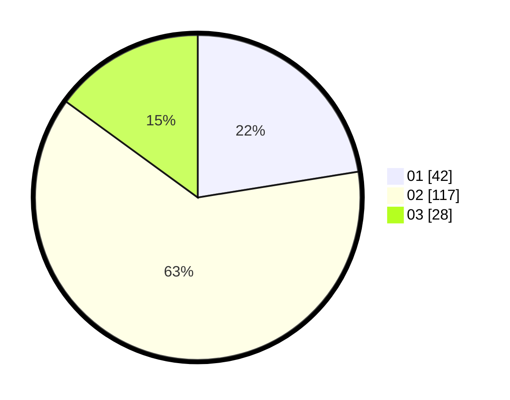

# Hasil

Hasil perolehan suara paslon dapat dilihat pada file paslon-01.txt, paslon-02.txt, dan paslon-03.txt.

Jika tidak ada, artinya data tersebut belum ada pada SIREKAP.

## Perolehan Suara

 * Paslon 01: **42**.
 * Paslon 02: **117**.
 * Paslon 03: **28**.

## Foto C Plano

https://sirekap-obj-formc.kpu.go.id/9031/pemilu/ppwp/31/73/01/10/05/3173011005431-20240214-193840--8208b92a-17d7-4ee6-966c-5c7cb6d4f4b0.jpg

https://sirekap-obj-formc.kpu.go.id/9031/pemilu/ppwp/31/73/01/10/05/3173011005431-20240214-201947--017f3b43-3ff6-4c81-99a6-510133b5de20.jpg

https://sirekap-obj-formc.kpu.go.id/9031/pemilu/ppwp/31/73/01/10/05/3173011005431-20240214-202129--30d26a52-ee14-442a-b087-f3b4d1cf8f59.jpg

## DATA PEMILIH TETAP

Jumlah pemilih dalam DPT: **190**.
 * L: **98**.
 * P: **92**.

## DATA PENGGUNA HAK PILIH

Jumlah pengguna hak pilih dalam DPT: **190**.
 * L: **98**.
 * P: **92**.

Jumlah pengguna hak pilih dalam DPTb: **0**.
 * L: **0**.
 * P: **0**.

Jumlah pengguna hak pilih dalam DPK: **2**.
 * L: **0**.
 * P: **2**.

Jumlah pengguna hak pilih: **192**.
 * L: **0**.
 * P: **0**.

## JUMLAH SUARA SAH DAN TIDAK SAH

JUMLAH SELURUH SUARA SAH: **187**.

JUMLAH SUARA TIDAK SAH: **5**.

JUMLAH SELURUH SUARA SAH DAN SUARA TIDAK SAH: **192**.
