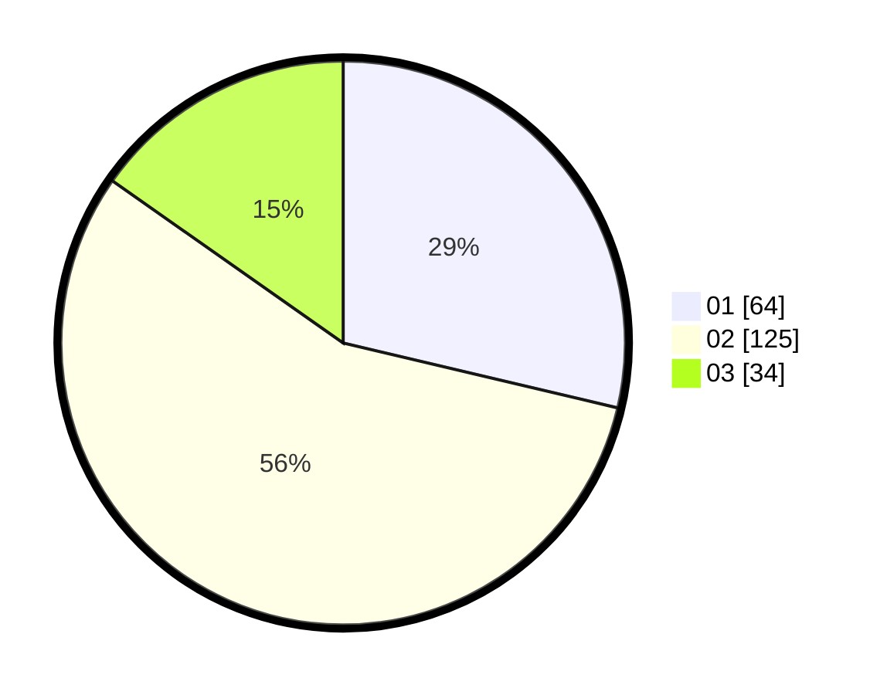

# Hasil

Hasil perolehan suara paslon dapat dilihat pada file paslon-01.txt, paslon-02.txt, dan paslon-03.txt.

Jika tidak ada, artinya data tersebut belum ada pada SIREKAP.

## Perolehan Suara

 * Paslon 01: **64**.
 * Paslon 02: **125**.
 * Paslon 03: **34**.

## Foto C Plano

https://sirekap-obj-formc.kpu.go.id/87a4/pemilu/ppwp/31/73/01/10/05/3173011005432-20240215-023433--7aca1687-b502-4373-96e5-fc0b272d6c76.jpg

https://sirekap-obj-formc.kpu.go.id/87a4/pemilu/ppwp/31/73/01/10/05/3173011005432-20240215-010346--17ea300a-e44c-4bcf-ba7c-0b5a9fc6f6a6.jpg

https://sirekap-obj-formc.kpu.go.id/87a4/pemilu/ppwp/31/73/01/10/05/3173011005432-20240215-010500--82451d7b-4115-454e-ba4f-e7e7c5345137.jpg
