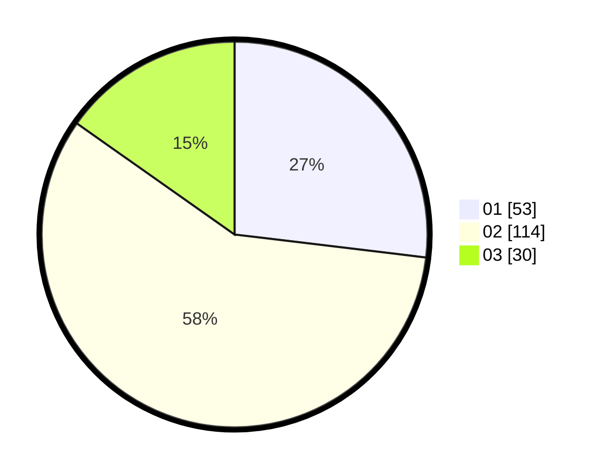

# Hasil

Hasil perolehan suara paslon dapat dilihat pada file paslon-01.txt, paslon-02.txt, dan paslon-03.txt.

Jika tidak ada, artinya data tersebut belum ada pada SIREKAP.

## Perolehan Suara

 * Paslon 01: **53**.
 * Paslon 02: **114**.
 * Paslon 03: **30**.

## Foto C Plano

https://sirekap-obj-formc.kpu.go.id/4447/pemilu/ppwp/31/73/01/10/05/3173011005436-20240214-225135--d2f9542f-1d7e-4ac0-9de4-66b4917899ce.jpg

https://sirekap-obj-formc.kpu.go.id/4447/pemilu/ppwp/31/73/01/10/05/3173011005436-20240214-225300--e2db8b61-6a35-4fc5-a45f-73b3424fe82a.jpg

https://sirekap-obj-formc.kpu.go.id/4447/pemilu/ppwp/31/73/01/10/05/3173011005436-20240214-225357--01ef8e4f-0557-4490-aa0a-949f6a170419.jpg
