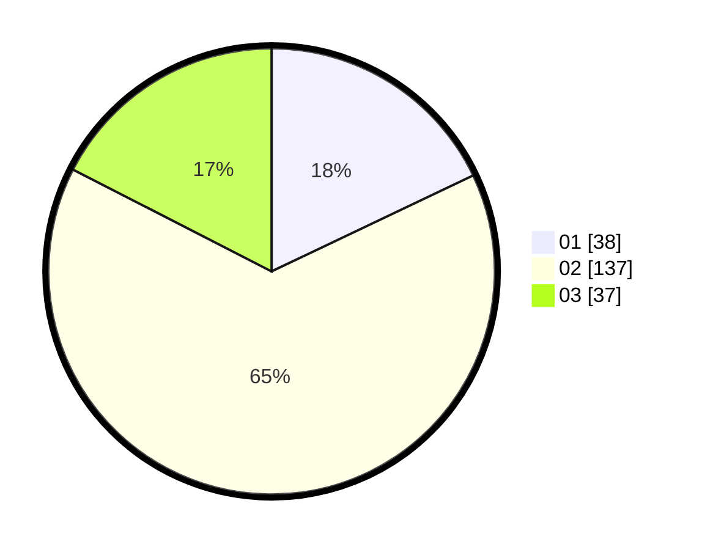

# Hasil

Hasil perolehan suara paslon dapat dilihat pada file paslon-01.txt, paslon-02.txt, dan paslon-03.txt.

Jika tidak ada, artinya data tersebut belum ada pada SIREKAP.

## Perolehan Suara

 * Paslon 01: **38**.
 * Paslon 02: **137**.
 * Paslon 03: **37**.

## Foto C Plano

https://sirekap-obj-formc.kpu.go.id/678a/pemilu/ppwp/31/73/01/10/05/3173011005437-20240216-065758--8b8e133d-dd28-4fb2-aa43-301c74476f51.jpg

https://sirekap-obj-formc.kpu.go.id/678a/pemilu/ppwp/31/73/01/10/05/3173011005437-20240216-065759--0e8ad701-1daa-4797-9567-f18e605fd50b.jpg

https://sirekap-obj-formc.kpu.go.id/678a/pemilu/ppwp/31/73/01/10/05/3173011005437-20240216-065759--816c405e-a53b-4ee0-8da5-6ca00653c12f.jpg

## DATA PEMILIH TETAP

Jumlah pemilih dalam DPT: **0**.
 * L: **0**.
 * P: **0**.

## DATA PENGGUNA HAK PILIH

Jumlah pengguna hak pilih dalam DPT: **0**.
 * L: **0**.
 * P: **0**.

Jumlah pengguna hak pilih dalam DPTb: **0**.
 * L: **0**.
 * P: **0**.

Jumlah pengguna hak pilih dalam DPK: **0**.
 * L: **0**.
 * P: **0**.

Jumlah pengguna hak pilih: **0**.
 * L: **0**.
 * P: **0**.

## JUMLAH SUARA SAH DAN TIDAK SAH

JUMLAH SELURUH SUARA SAH: **212**.

JUMLAH SUARA TIDAK SAH: **2**.

JUMLAH SELURUH SUARA SAH DAN SUARA TIDAK SAH: **214**.
