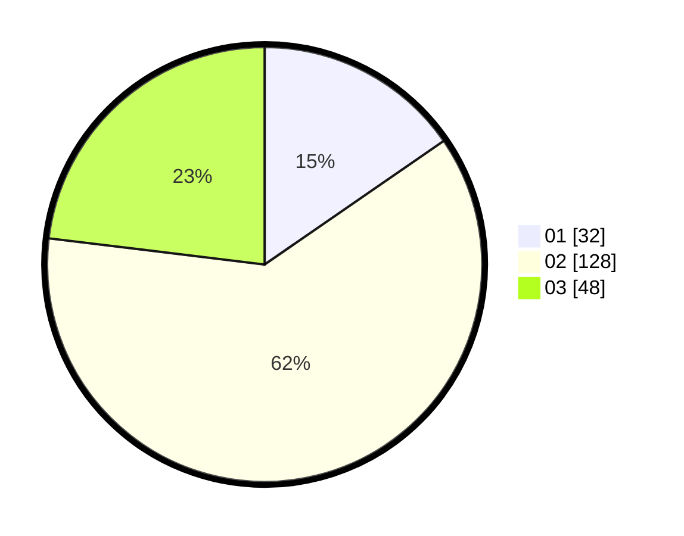

# Hasil

Hasil perolehan suara paslon dapat dilihat pada file paslon-01.txt, paslon-02.txt, dan paslon-03.txt.

Jika tidak ada, artinya data tersebut belum ada pada SIREKAP.

## Perolehan Suara

 * Paslon 01: **32**.
 * Paslon 02: **128**.
 * Paslon 03: **48**.

## Foto C Plano

https://sirekap-obj-formc.kpu.go.id/33a1/pemilu/ppwp/31/73/01/10/05/3173011005438-20240214-155412--e6b19ec0-3c1e-469a-bdea-64d638c58ea1.jpg

https://sirekap-obj-formc.kpu.go.id/33a1/pemilu/ppwp/31/73/01/10/05/3173011005438-20240214-155219--5a0bd5d0-5e17-4cde-a90f-226faf204bef.jpg

https://sirekap-obj-formc.kpu.go.id/33a1/pemilu/ppwp/31/73/01/10/05/3173011005438-20240214-155657--f15c7a0b-0b66-43ac-9f57-43dd1b0afbd1.jpg

## DATA PEMILIH TETAP

Jumlah pemilih dalam DPT: **281**.
 * L: **140**.
 * P: **141**.

## DATA PENGGUNA HAK PILIH

Jumlah pengguna hak pilih dalam DPT: **212**.
 * L: **102**.
 * P: **110**.

Jumlah pengguna hak pilih dalam DPTb: **0**.
 * L: **0**.
 * P: **0**.

Jumlah pengguna hak pilih dalam DPK: **0**.
 * L: **0**.
 * P: **0**.

Jumlah pengguna hak pilih: **212**.
 * L: **102**.
 * P: **110**.

## JUMLAH SUARA SAH DAN TIDAK SAH

JUMLAH SELURUH SUARA SAH: **208**.

JUMLAH SUARA TIDAK SAH: **4**.

JUMLAH SELURUH SUARA SAH DAN SUARA TIDAK SAH: **212**.
