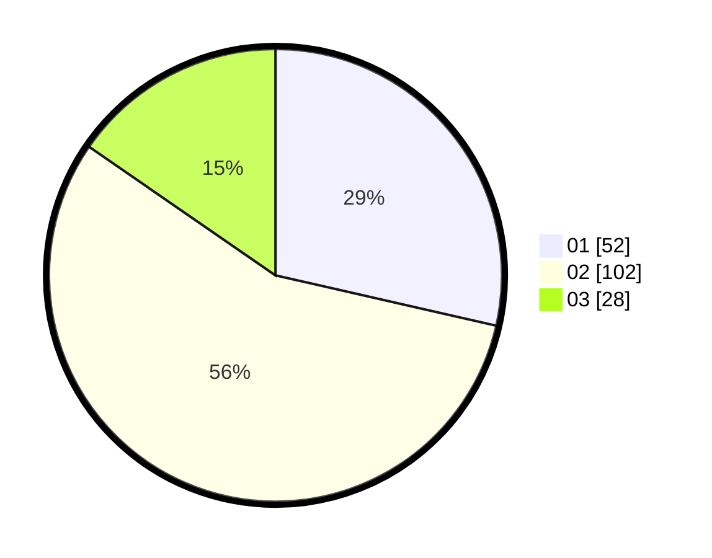

# Hasil

Hasil perolehan suara paslon dapat dilihat pada file paslon-01.txt, paslon-02.txt, dan paslon-03.txt.

Jika tidak ada, artinya data tersebut belum ada pada SIREKAP.

## Perolehan Suara

 * Paslon 01: **52**.
 * Paslon 02: **102**.
 * Paslon 03: **28**.

## Foto C Plano

https://sirekap-obj-formc.kpu.go.id/2f51/pemilu/ppwp/31/73/01/10/05/3173011005444-20240214-222910--d280cb8e-ffcd-472e-bd81-ea932f5a6855.jpg

https://sirekap-obj-formc.kpu.go.id/2f51/pemilu/ppwp/31/73/01/10/05/3173011005444-20240214-235817--92c9ca4c-0b94-419b-b808-0ba2fa3e091a.jpg

https://sirekap-obj-formc.kpu.go.id/2f51/pemilu/ppwp/31/73/01/10/05/3173011005444-20240214-223152--b25be2f4-efc5-442f-87d0-c5609e4ac1bf.jpg
