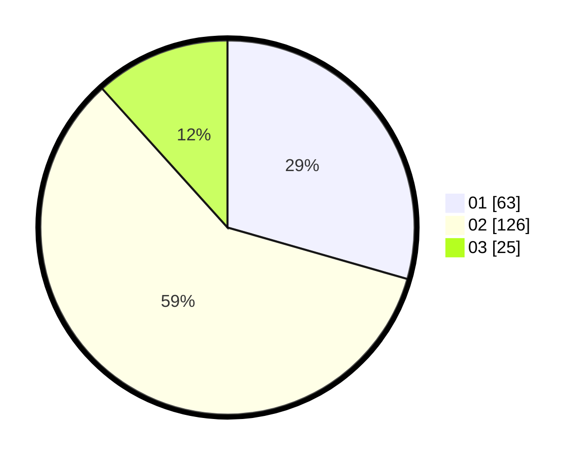

# Hasil

Hasil perolehan suara paslon dapat dilihat pada file paslon-01.txt, paslon-02.txt, dan paslon-03.txt.

Jika tidak ada, artinya data tersebut belum ada pada SIREKAP.

## Perolehan Suara

 * Paslon 01: **63**.
 * Paslon 02: **126**.
 * Paslon 03: **25**.

## Foto C Plano

https://sirekap-obj-formc.kpu.go.id/4482/pemilu/ppwp/31/73/01/10/05/3173011005448-20240216-001707--3fda3704-f121-4d8c-a0ae-4b1081ced97c.jpg

https://sirekap-obj-formc.kpu.go.id/4482/pemilu/ppwp/31/73/01/10/05/3173011005448-20240216-001710--2838761f-963c-430a-a93d-6b9dab47cbe5.jpg

https://sirekap-obj-formc.kpu.go.id/4482/pemilu/ppwp/31/73/01/10/05/3173011005448-20240216-001709--a5cf5f9b-bee3-4433-bfe7-9cfca9176e46.jpg

## DATA PEMILIH TETAP

Jumlah pemilih dalam DPT: **285**.
 * L: **143**.
 * P: **142**.

## DATA PENGGUNA HAK PILIH

Jumlah pengguna hak pilih dalam DPT: **217**.
 * L: **103**.
 * P: **114**.

Jumlah pengguna hak pilih dalam DPTb: **0**.
 * L: **0**.
 * P: **0**.

Jumlah pengguna hak pilih dalam DPK: **0**.
 * L: **0**.
 * P: **0**.

Jumlah pengguna hak pilih: **217**.
 * L: **103**.
 * P: **114**.

## JUMLAH SUARA SAH DAN TIDAK SAH

JUMLAH SELURUH SUARA SAH: **214**.

JUMLAH SUARA TIDAK SAH: **3**.

JUMLAH SELURUH SUARA SAH DAN SUARA TIDAK SAH: **217**.
