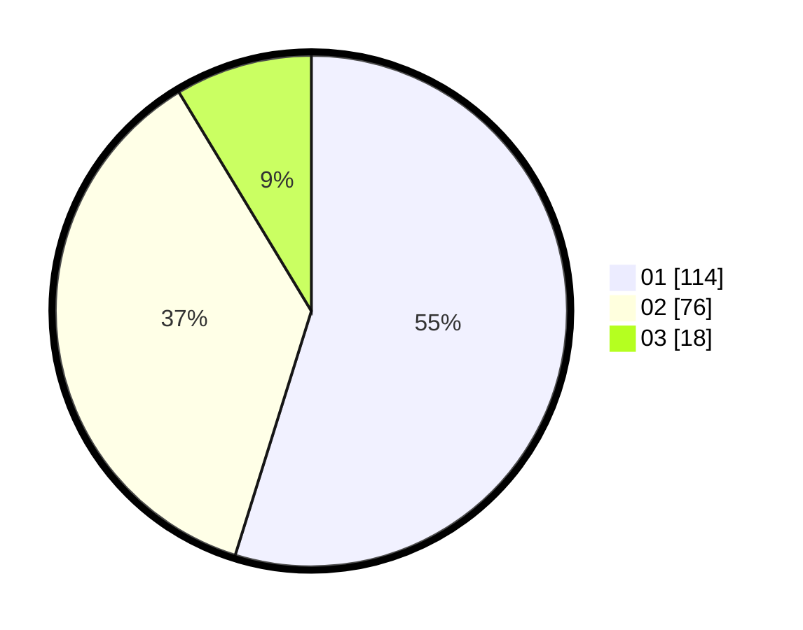

# Hasil

Hasil perolehan suara paslon dapat dilihat pada file paslon-01.txt, paslon-02.txt, dan paslon-03.txt.

Jika tidak ada, artinya data tersebut belum ada pada SIREKAP.

## Perolehan Suara

 * Paslon 01: **114**.
 * Paslon 02: **76**.
 * Paslon 03: **18**.

## Foto C Plano

https://sirekap-obj-formc.kpu.go.id/5356/pemilu/ppwp/31/73/01/10/06/3173011006003-20240216-050233--6737bd16-4e22-4f62-9f83-51d77dca04e8.jpg

https://sirekap-obj-formc.kpu.go.id/5356/pemilu/ppwp/31/73/01/10/06/3173011006003-20240216-050235--0fd918b1-f8ae-49b1-ab4c-f44e6a289802.jpg

https://sirekap-obj-formc.kpu.go.id/5356/pemilu/ppwp/31/73/01/10/06/3173011006003-20240216-045646--213c0e9e-89f2-4da1-9be7-e35b074e66cc.jpg

## DATA PEMILIH TETAP

Jumlah pemilih dalam DPT: **291**.
 * L: **151**.
 * P: **140**.

## DATA PENGGUNA HAK PILIH

Jumlah pengguna hak pilih dalam DPT: **211**.
 * L: **107**.
 * P: **104**.

Jumlah pengguna hak pilih dalam DPTb: **0**.
 * L: **0**.
 * P: **0**.

Jumlah pengguna hak pilih dalam DPK: **0**.
 * L: **0**.
 * P: **0**.

Jumlah pengguna hak pilih: **211**.
 * L: **107**.
 * P: **104**.

## JUMLAH SUARA SAH DAN TIDAK SAH

JUMLAH SELURUH SUARA SAH: **208**.

JUMLAH SUARA TIDAK SAH: **3**.

JUMLAH SELURUH SUARA SAH DAN SUARA TIDAK SAH: **211**.
