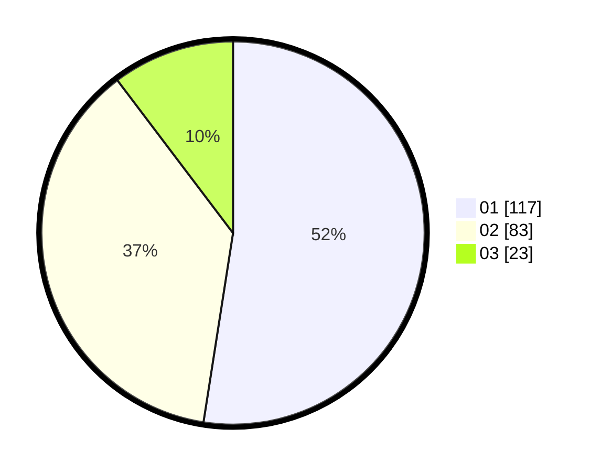

# Hasil

Hasil perolehan suara paslon dapat dilihat pada file paslon-01.txt, paslon-02.txt, dan paslon-03.txt.

Jika tidak ada, artinya data tersebut belum ada pada SIREKAP.

## Perolehan Suara

 * Paslon 01: **117**.
 * Paslon 02: **83**.
 * Paslon 03: **23**.

## Foto C Plano

https://sirekap-obj-formc.kpu.go.id/8115/pemilu/ppwp/31/73/01/10/06/3173011006006-20240214-210158--d223c02c-e8cb-49e9-b225-6e457d46629d.jpg

https://sirekap-obj-formc.kpu.go.id/8115/pemilu/ppwp/31/73/01/10/06/3173011006006-20240214-210220--2e606f17-e038-4879-b544-55d5d0a9c2ef.jpg

https://sirekap-obj-formc.kpu.go.id/8115/pemilu/ppwp/31/73/01/10/06/3173011006006-20240214-210209--e3665c93-7ee0-41c3-bdde-9ffc5714f058.jpg

## DATA PEMILIH TETAP

Jumlah pemilih dalam DPT: **289**.
 * L: **150**.
 * P: **139**.

## DATA PENGGUNA HAK PILIH

Jumlah pengguna hak pilih dalam DPT: **218**.
 * L: **103**.
 * P: **115**.

Jumlah pengguna hak pilih dalam DPTb: **0**.
 * L: **0**.
 * P: **0**.

Jumlah pengguna hak pilih dalam DPK: **8**.
 * L: **3**.
 * P: **5**.

Jumlah pengguna hak pilih: **226**.
 * L: **106**.
 * P: **120**.

## JUMLAH SUARA SAH DAN TIDAK SAH

JUMLAH SELURUH SUARA SAH: **223**.

JUMLAH SUARA TIDAK SAH: **3**.

JUMLAH SELURUH SUARA SAH DAN SUARA TIDAK SAH: **226**.
