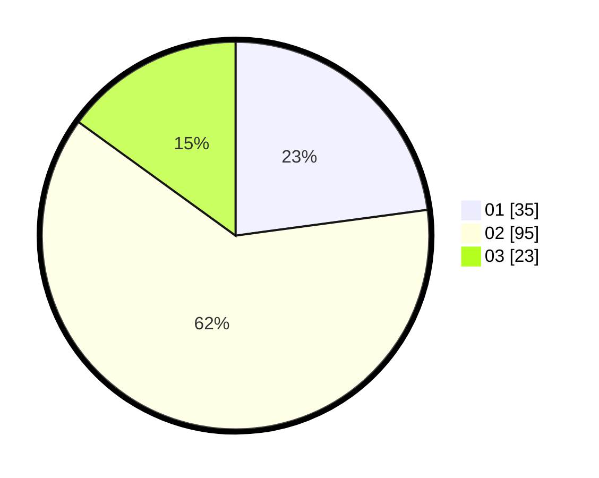

# Hasil

Hasil perolehan suara paslon dapat dilihat pada file paslon-01.txt, paslon-02.txt, dan paslon-03.txt.

Jika tidak ada, artinya data tersebut belum ada pada SIREKAP.

## Perolehan Suara

 * Paslon 01: **35**.
 * Paslon 02: **95**.
 * Paslon 03: **23**.

## Foto C Plano

https://sirekap-obj-formc.kpu.go.id/2757/pemilu/ppwp/31/73/01/10/06/3173011006018-20240214-155609--9df2ad1a-e3f6-4004-bd41-dee1adb11d58.jpg

https://sirekap-obj-formc.kpu.go.id/2757/pemilu/ppwp/31/73/01/10/06/3173011006018-20240214-160159--5e2cd616-66cb-462e-843d-2d538398542a.jpg

https://sirekap-obj-formc.kpu.go.id/2757/pemilu/ppwp/31/73/01/10/06/3173011006018-20240214-155250--a6bb5bc5-56d2-4637-8767-70daf5af081e.jpg
