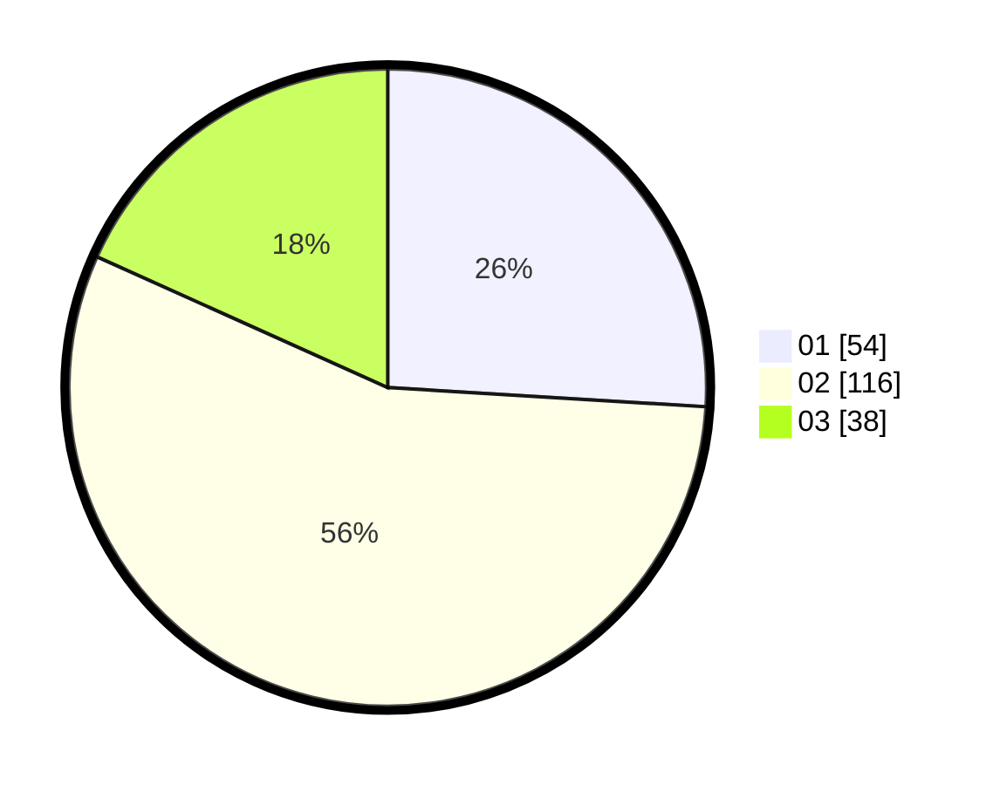

# Hasil

Hasil perolehan suara paslon dapat dilihat pada file paslon-01.txt, paslon-02.txt, dan paslon-03.txt.

Jika tidak ada, artinya data tersebut belum ada pada SIREKAP.

## Perolehan Suara

 * Paslon 01: **54**.
 * Paslon 02: **116**.
 * Paslon 03: **38**.

## Foto C Plano

https://sirekap-obj-formc.kpu.go.id/2194/pemilu/ppwp/31/73/01/10/06/3173011006020-20240214-230752--d885d407-31f0-4839-b34f-0c8f3c468087.jpg

https://sirekap-obj-formc.kpu.go.id/2194/pemilu/ppwp/31/73/01/10/06/3173011006020-20240214-230839--89bc37d6-ea5d-4685-ba13-96005a1cfb53.jpg

https://sirekap-obj-formc.kpu.go.id/2194/pemilu/ppwp/31/73/01/10/06/3173011006020-20240214-232546--8ce1a686-7207-452f-8af6-21e9705fb68c.jpg
