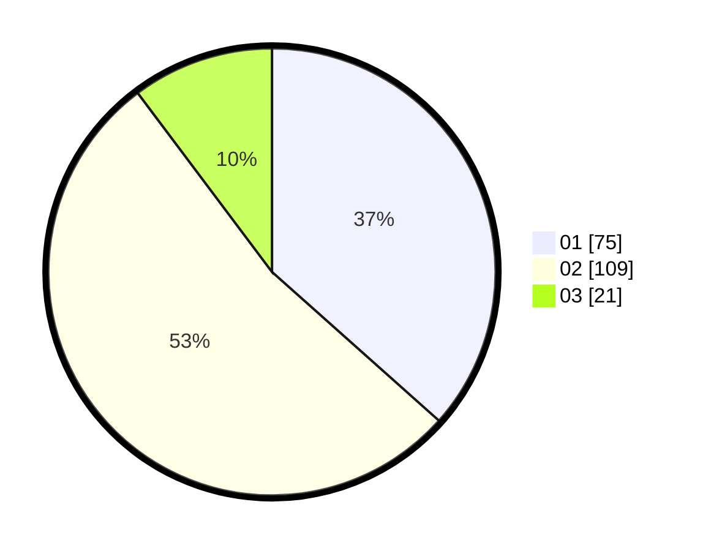

# Hasil

Hasil perolehan suara paslon dapat dilihat pada file paslon-01.txt, paslon-02.txt, dan paslon-03.txt.

Jika tidak ada, artinya data tersebut belum ada pada SIREKAP.

## Perolehan Suara

 * Paslon 01: **75**.
 * Paslon 02: **109**.
 * Paslon 03: **21**.

## Foto C Plano

https://sirekap-obj-formc.kpu.go.id/0436/pemilu/ppwp/31/73/01/10/06/3173011006024-20240215-010521--6f624d0f-e7c4-4992-b498-97422089845b.jpg

https://sirekap-obj-formc.kpu.go.id/0436/pemilu/ppwp/31/73/01/10/06/3173011006024-20240215-035007--c03ca402-c207-4a16-82aa-abbc386ab225.jpg

https://sirekap-obj-formc.kpu.go.id/0436/pemilu/ppwp/31/73/01/10/06/3173011006024-20240215-010840--7ef55794-3e14-4ab5-b42c-c2c17ac9f33d.jpg
