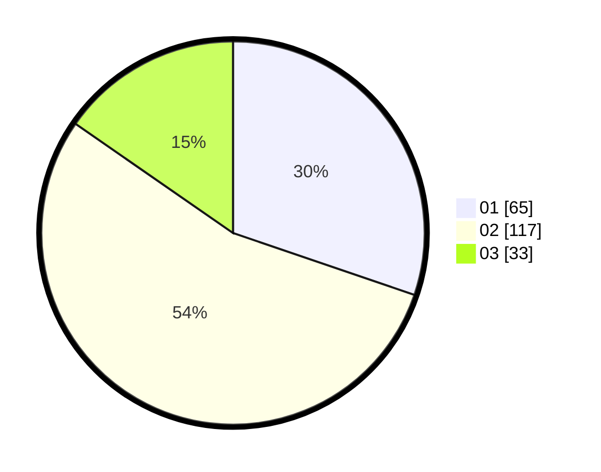

# Hasil

Hasil perolehan suara paslon dapat dilihat pada file paslon-01.txt, paslon-02.txt, dan paslon-03.txt.

Jika tidak ada, artinya data tersebut belum ada pada SIREKAP.

## Perolehan Suara

 * Paslon 01: **65**.
 * Paslon 02: **117**.
 * Paslon 03: **33**.

## Foto C Plano

https://sirekap-obj-formc.kpu.go.id/b4cd/pemilu/ppwp/31/73/01/10/06/3173011006026-20240214-234422--f8fe5124-3107-44ae-adf2-39ba7180f317.jpg

https://sirekap-obj-formc.kpu.go.id/b4cd/pemilu/ppwp/31/73/01/10/06/3173011006026-20240214-234425--e9580483-8616-4a70-b572-4d2b9dcdd428.jpg

https://sirekap-obj-formc.kpu.go.id/b4cd/pemilu/ppwp/31/73/01/10/06/3173011006026-20240214-234429--78d82cb7-eec7-4567-a1fb-e78498d19d4c.jpg
