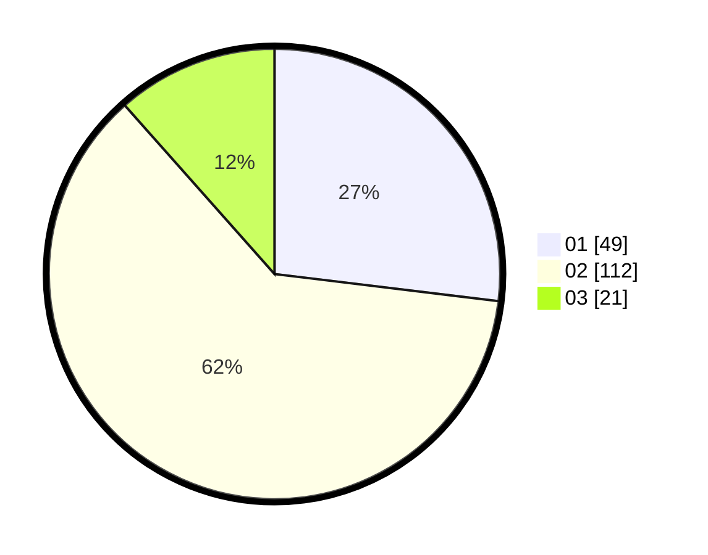

# Hasil

Hasil perolehan suara paslon dapat dilihat pada file paslon-01.txt, paslon-02.txt, dan paslon-03.txt.

Jika tidak ada, artinya data tersebut belum ada pada SIREKAP.

## Perolehan Suara

 * Paslon 01: **49**.
 * Paslon 02: **112**.
 * Paslon 03: **21**.

## Foto C Plano

https://sirekap-obj-formc.kpu.go.id/50cc/pemilu/ppwp/31/73/01/10/06/3173011006027-20240215-135521--35a13c82-ee84-4ba9-bb82-06ea4f91fa3c.jpg

https://sirekap-obj-formc.kpu.go.id/50cc/pemilu/ppwp/31/73/01/10/06/3173011006027-20240214-191406--6d69aad2-946e-4fde-be14-c446dc5464a6.jpg

https://sirekap-obj-formc.kpu.go.id/50cc/pemilu/ppwp/31/73/01/10/06/3173011006027-20240215-135532--96d28402-12ce-44c8-bb5f-764230b1f0cc.jpg

## DATA PEMILIH TETAP

Jumlah pemilih dalam DPT: **292**.
 * L: **153**.
 * P: **139**.

## DATA PENGGUNA HAK PILIH

Jumlah pengguna hak pilih dalam DPT: **184**.
 * L: **90**.
 * P: **94**.

Jumlah pengguna hak pilih dalam DPTb: **0**.
 * L: **0**.
 * P: **0**.

Jumlah pengguna hak pilih dalam DPK: **0**.
 * L: **0**.
 * P: **0**.

Jumlah pengguna hak pilih: **184**.
 * L: **90**.
 * P: **94**.

## JUMLAH SUARA SAH DAN TIDAK SAH

JUMLAH SELURUH SUARA SAH: **182**.

JUMLAH SUARA TIDAK SAH: **2**.

JUMLAH SELURUH SUARA SAH DAN SUARA TIDAK SAH: **184**.
