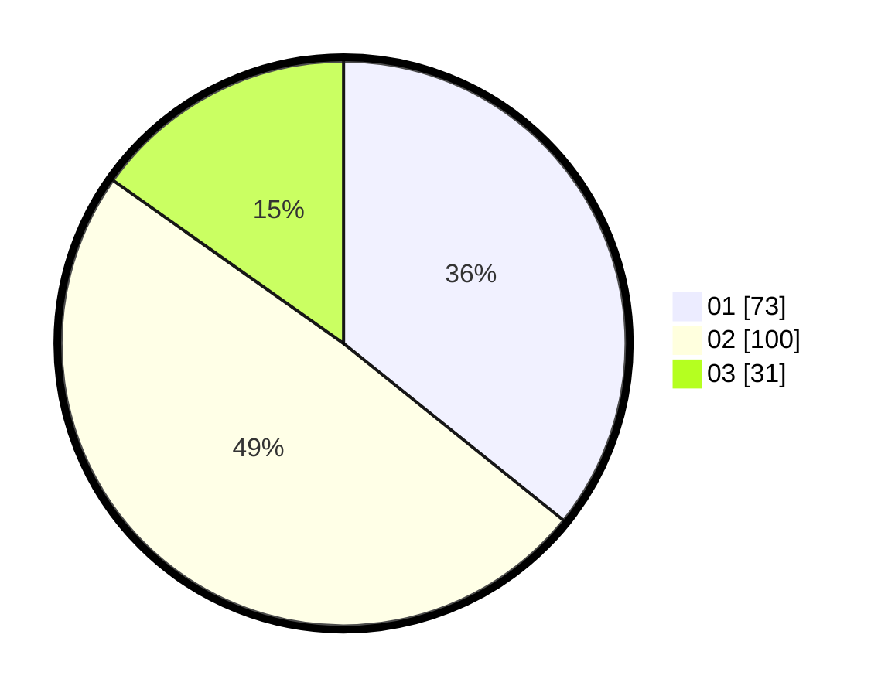

# Hasil

Hasil perolehan suara paslon dapat dilihat pada file paslon-01.txt, paslon-02.txt, dan paslon-03.txt.

Jika tidak ada, artinya data tersebut belum ada pada SIREKAP.

## Perolehan Suara

 * Paslon 01: **73**.
 * Paslon 02: **100**.
 * Paslon 03: **31**.

## Foto C Plano

https://sirekap-obj-formc.kpu.go.id/1939/pemilu/ppwp/31/73/01/10/06/3173011006028-20240214-213130--322f5600-2962-49d1-a355-2c35b76b7ebc.jpg

https://sirekap-obj-formc.kpu.go.id/1939/pemilu/ppwp/31/73/01/10/06/3173011006028-20240214-213236--94a4a8f8-e2b3-4832-b8d0-55cb5e19f5b6.jpg

https://sirekap-obj-formc.kpu.go.id/1939/pemilu/ppwp/31/73/01/10/06/3173011006028-20240214-213331--e774c0d5-5c35-4a1b-9969-bc3b1e30a60c.jpg
