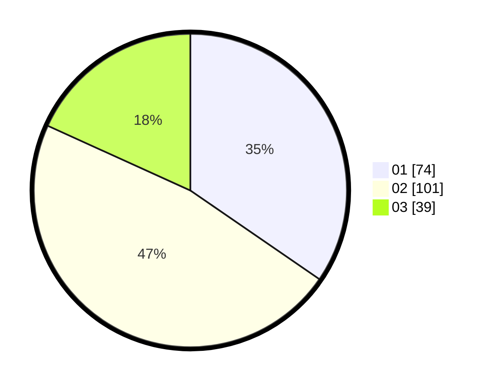

# Hasil

Hasil perolehan suara paslon dapat dilihat pada file paslon-01.txt, paslon-02.txt, dan paslon-03.txt.

Jika tidak ada, artinya data tersebut belum ada pada SIREKAP.

## Perolehan Suara

 * Paslon 01: **74**.
 * Paslon 02: **101**.
 * Paslon 03: **39**.

## Foto C Plano

https://sirekap-obj-formc.kpu.go.id/d536/pemilu/ppwp/31/73/01/10/06/3173011006033-20240216-001744--ba450ffc-91dd-43ed-bcbb-7b8bb21295fe.jpg

https://sirekap-obj-formc.kpu.go.id/d536/pemilu/ppwp/31/73/01/10/06/3173011006033-20240216-001746--2774502b-bc6c-4e61-a25d-f26a365884db.jpg

https://sirekap-obj-formc.kpu.go.id/d536/pemilu/ppwp/31/73/01/10/06/3173011006033-20240216-001745--f931e4d8-61b8-453c-acb3-f2c38f62110a.jpg

## DATA PEMILIH TETAP

Jumlah pemilih dalam DPT: **296**.
 * L: **151**.
 * P: **145**.

## DATA PENGGUNA HAK PILIH

Jumlah pengguna hak pilih dalam DPT: **217**.
 * L: **108**.
 * P: **109**.

Jumlah pengguna hak pilih dalam DPTb: **0**.
 * L: **0**.
 * P: **0**.

Jumlah pengguna hak pilih dalam DPK: **0**.
 * L: **0**.
 * P: **0**.

Jumlah pengguna hak pilih: **217**.
 * L: **108**.
 * P: **109**.

## JUMLAH SUARA SAH DAN TIDAK SAH

JUMLAH SELURUH SUARA SAH: **214**.

JUMLAH SUARA TIDAK SAH: **3**.

JUMLAH SELURUH SUARA SAH DAN SUARA TIDAK SAH: **217**.
