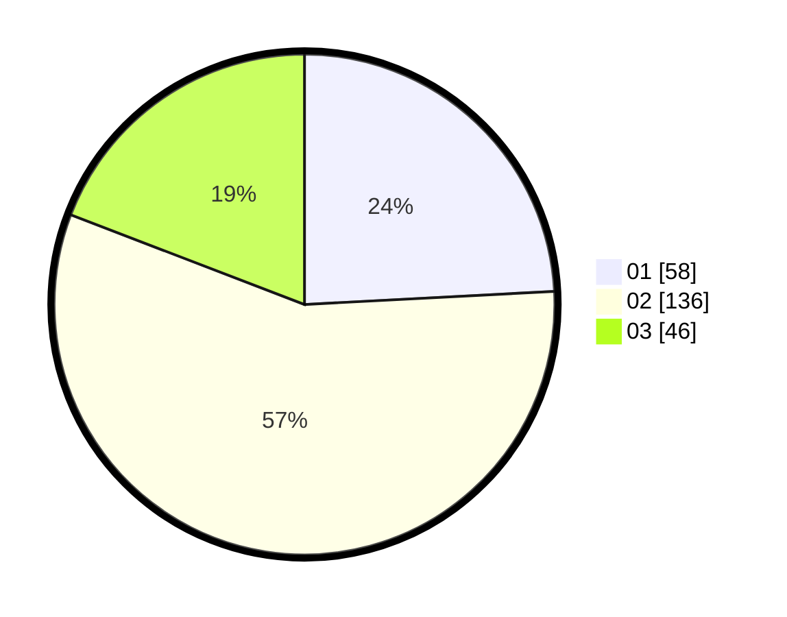

# Hasil

Hasil perolehan suara paslon dapat dilihat pada file paslon-01.txt, paslon-02.txt, dan paslon-03.txt.

Jika tidak ada, artinya data tersebut belum ada pada SIREKAP.

## Perolehan Suara

 * Paslon 01: **58**.
 * Paslon 02: **136**.
 * Paslon 03: **46**.

## Foto C Plano

https://sirekap-obj-formc.kpu.go.id/c2d7/pemilu/ppwp/31/73/01/10/06/3173011006034-20240216-034159--74db5900-c3c1-4426-8e06-fcae9c4118d7.jpg

https://sirekap-obj-formc.kpu.go.id/c2d7/pemilu/ppwp/31/73/01/10/06/3173011006034-20240216-034200--fb2cdf14-0650-40a8-9401-7ace5d12d5b1.jpg

https://sirekap-obj-formc.kpu.go.id/c2d7/pemilu/ppwp/31/73/01/10/06/3173011006034-20240216-034200--a61909d6-f2ec-42a5-bd12-ddb086c1e896.jpg

## DATA PEMILIH TETAP

Jumlah pemilih dalam DPT: **298**.
 * L: **147**.
 * P: **151**.

## DATA PENGGUNA HAK PILIH

Jumlah pengguna hak pilih dalam DPT: **243**.
 * L: **111**.
 * P: **132**.

Jumlah pengguna hak pilih dalam DPTb: **0**.
 * L: **0**.
 * P: **0**.

Jumlah pengguna hak pilih dalam DPK: **0**.
 * L: **0**.
 * P: **0**.

Jumlah pengguna hak pilih: **243**.
 * L: **111**.
 * P: **132**.

## JUMLAH SUARA SAH DAN TIDAK SAH

JUMLAH SELURUH SUARA SAH: **240**.

JUMLAH SUARA TIDAK SAH: **3**.

JUMLAH SELURUH SUARA SAH DAN SUARA TIDAK SAH: **243**.
