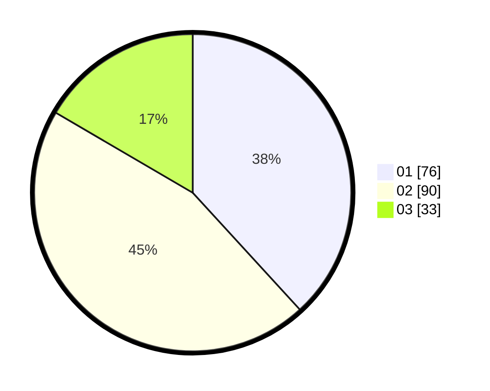

# Hasil

Hasil perolehan suara paslon dapat dilihat pada file paslon-01.txt, paslon-02.txt, dan paslon-03.txt.

Jika tidak ada, artinya data tersebut belum ada pada SIREKAP.

## Perolehan Suara

 * Paslon 01: **76**.
 * Paslon 02: **90**.
 * Paslon 03: **33**.

## Foto C Plano

https://sirekap-obj-formc.kpu.go.id/c1c1/pemilu/ppwp/31/73/01/10/06/3173011006039-20240215-102655--a9d142a0-28e3-41fd-bccc-1852cff4efc0.jpg

https://sirekap-obj-formc.kpu.go.id/c1c1/pemilu/ppwp/31/73/01/10/06/3173011006039-20240217-120939--fbe1ab98-77e4-4fbf-b76e-00c8756f220b.jpg

https://sirekap-obj-formc.kpu.go.id/c1c1/pemilu/ppwp/31/73/01/10/06/3173011006039-20240214-193851--858ab8bb-7e07-4b10-84da-9471de192584.jpg

## DATA PEMILIH TETAP

Jumlah pemilih dalam DPT: **273**.
 * L: **145**.
 * P: **125**.

## DATA PENGGUNA HAK PILIH

Jumlah pengguna hak pilih dalam DPT: **179**.
 * L: **100**.
 * P: **79**.

Jumlah pengguna hak pilih dalam DPTb: **0**.
 * L: **0**.
 * P: **0**.

Jumlah pengguna hak pilih dalam DPK: **7**.
 * L: **3**.
 * P: **4**.

Jumlah pengguna hak pilih: **204**.
 * L: **103**.
 * P: **101**.

## JUMLAH SUARA SAH DAN TIDAK SAH

JUMLAH SELURUH SUARA SAH: **199**.

JUMLAH SUARA TIDAK SAH: **5**.

JUMLAH SELURUH SUARA SAH DAN SUARA TIDAK SAH: **204**.
