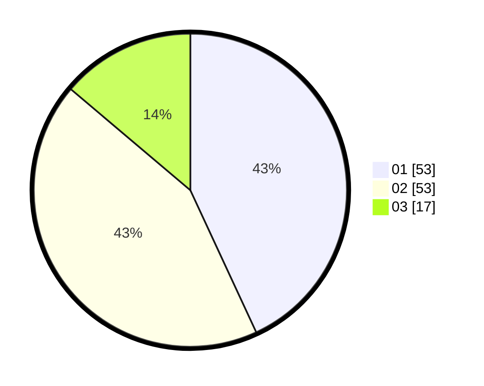

# Hasil

Hasil perolehan suara paslon dapat dilihat pada file paslon-01.txt, paslon-02.txt, dan paslon-03.txt.

Jika tidak ada, artinya data tersebut belum ada pada SIREKAP.

## Perolehan Suara

 * Paslon 01: **53**.
 * Paslon 02: **53**.
 * Paslon 03: **17**.

## Foto C Plano

https://sirekap-obj-formc.kpu.go.id/146c/pemilu/ppwp/31/73/01/10/06/3173011006044-20240216-055352--3b791619-f8e2-4099-a10a-934f4cf8fda9.jpg

https://sirekap-obj-formc.kpu.go.id/146c/pemilu/ppwp/31/73/01/10/06/3173011006044-20240216-055353--d249b31b-64e2-4872-934a-a521f36e51c7.jpg

https://sirekap-obj-formc.kpu.go.id/146c/pemilu/ppwp/31/73/01/10/06/3173011006044-20240216-055353--b9d9702f-4965-4b6c-9b50-5ece526fe81e.jpg

## DATA PEMILIH TETAP

Jumlah pemilih dalam DPT: **154**.
 * L: **77**.
 * P: **77**.

## DATA PENGGUNA HAK PILIH

Jumlah pengguna hak pilih dalam DPT: **120**.
 * L: **60**.
 * P: **60**.

Jumlah pengguna hak pilih dalam DPTb: **2**.
 * L: **1**.
 * P: **1**.

Jumlah pengguna hak pilih dalam DPK: **2**.
 * L: **0**.
 * P: **2**.

Jumlah pengguna hak pilih: **124**.
 * L: **61**.
 * P: **63**.

## JUMLAH SUARA SAH DAN TIDAK SAH

JUMLAH SELURUH SUARA SAH: **123**.

JUMLAH SUARA TIDAK SAH: **1**.

JUMLAH SELURUH SUARA SAH DAN SUARA TIDAK SAH: **124**.
