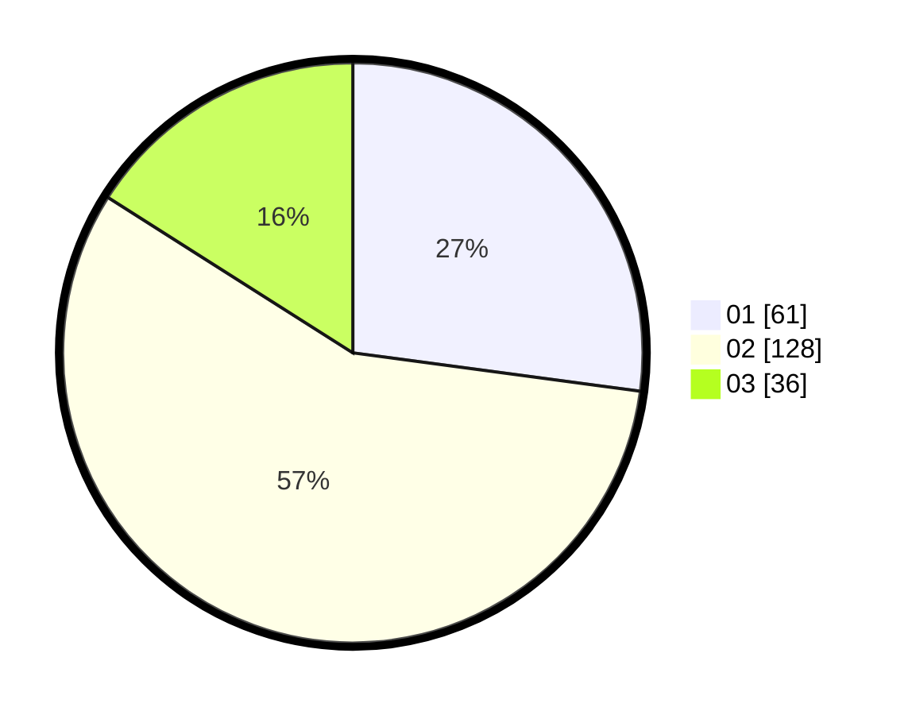

# Hasil

Hasil perolehan suara paslon dapat dilihat pada file paslon-01.txt, paslon-02.txt, dan paslon-03.txt.

Jika tidak ada, artinya data tersebut belum ada pada SIREKAP.

## Perolehan Suara

 * Paslon 01: **61**.
 * Paslon 02: **128**.
 * Paslon 03: **36**.

## Foto C Plano

https://sirekap-obj-formc.kpu.go.id/a7ab/pemilu/ppwp/31/73/01/10/06/3173011006049-20240214-222059--ae124536-02ad-4db2-bc15-339816fad2e9.jpg

https://sirekap-obj-formc.kpu.go.id/a7ab/pemilu/ppwp/31/73/01/10/06/3173011006049-20240214-222156--8184f3df-e6b7-4e51-94f2-25a24dc9b96c.jpg

https://sirekap-obj-formc.kpu.go.id/a7ab/pemilu/ppwp/31/73/01/10/06/3173011006049-20240214-222235--093f960b-f452-4965-9b78-7656356b8947.jpg
