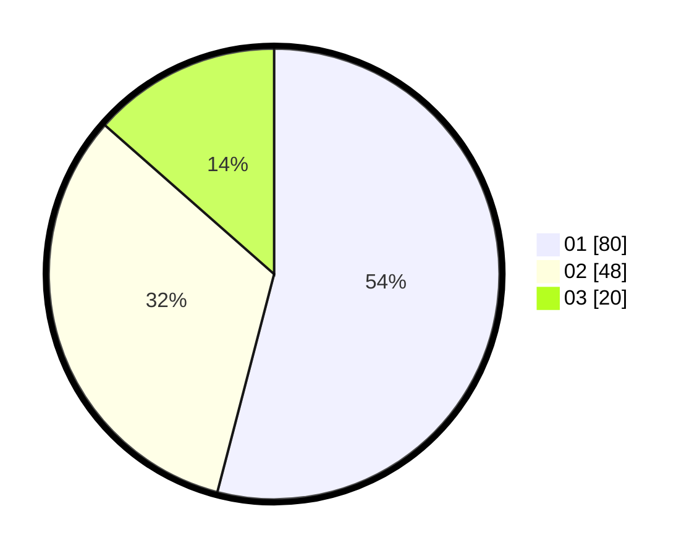

# Hasil

Hasil perolehan suara paslon dapat dilihat pada file paslon-01.txt, paslon-02.txt, dan paslon-03.txt.

Jika tidak ada, artinya data tersebut belum ada pada SIREKAP.

## Perolehan Suara

 * Paslon 01: **80**.
 * Paslon 02: **48**.
 * Paslon 03: **20**.

## Foto C Plano

https://sirekap-obj-formc.kpu.go.id/91c1/pemilu/ppwp/31/73/01/10/06/3173011006051-20240214-192632--90947b0d-3bc6-4950-a473-92cf9d3b0d7b.jpg

https://sirekap-obj-formc.kpu.go.id/91c1/pemilu/ppwp/31/73/01/10/06/3173011006051-20240214-192841--c74c8290-c3f3-4b7f-a338-b55a1d11f1b6.jpg

https://sirekap-obj-formc.kpu.go.id/91c1/pemilu/ppwp/31/73/01/10/06/3173011006051-20240214-193350--c289a64b-c315-428d-a8ad-98bec4ae1065.jpg

## DATA PEMILIH TETAP

Jumlah pemilih dalam DPT: **200**.
 * L: **95**.
 * P: **105**.

## DATA PENGGUNA HAK PILIH

Jumlah pengguna hak pilih dalam DPT: **147**.
 * L: **68**.
 * P: **79**.

Jumlah pengguna hak pilih dalam DPTb: **0**.
 * L: **0**.
 * P: **0**.

Jumlah pengguna hak pilih dalam DPK: **1**.
 * L: **0**.
 * P: **1**.

Jumlah pengguna hak pilih: **148**.
 * L: **68**.
 * P: **80**.

## JUMLAH SUARA SAH DAN TIDAK SAH

JUMLAH SELURUH SUARA SAH: **148**.

JUMLAH SUARA TIDAK SAH: **0**.

JUMLAH SELURUH SUARA SAH DAN SUARA TIDAK SAH: **148**.
