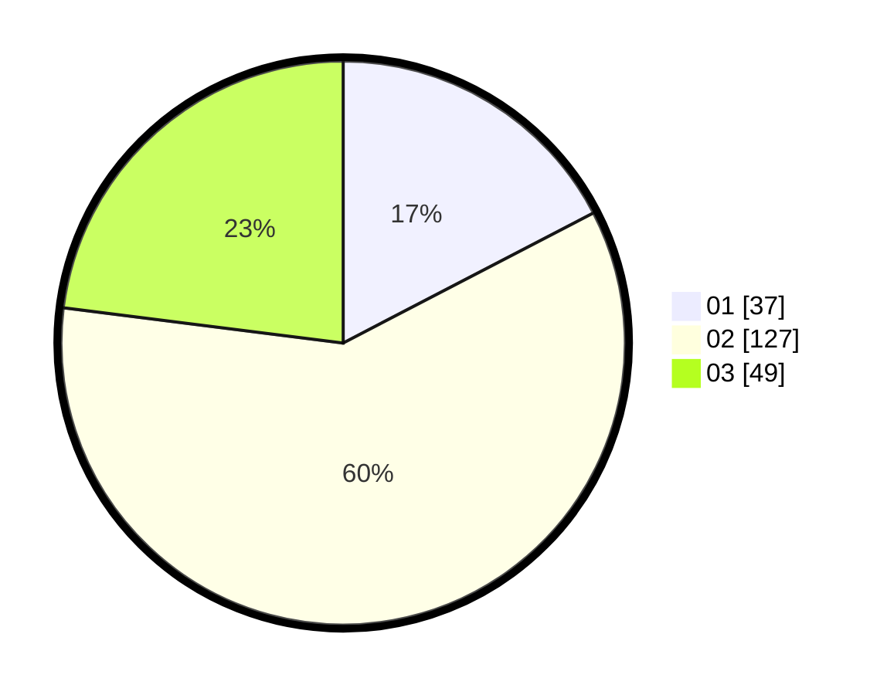

# Hasil

Hasil perolehan suara paslon dapat dilihat pada file paslon-01.txt, paslon-02.txt, dan paslon-03.txt.

Jika tidak ada, artinya data tersebut belum ada pada SIREKAP.

## Perolehan Suara

 * Paslon 01: **37**.
 * Paslon 02: **127**.
 * Paslon 03: **49**.

## Foto C Plano

https://sirekap-obj-formc.kpu.go.id/0ee4/pemilu/ppwp/31/73/01/10/06/3173011006054-20240216-034856--718c1964-ddb8-4038-add9-8ede8ae05d18.jpg

https://sirekap-obj-formc.kpu.go.id/0ee4/pemilu/ppwp/31/73/01/10/06/3173011006054-20240216-034907--c2c65f6a-f5ee-40e3-8ab3-e9050750c9f1.jpg

https://sirekap-obj-formc.kpu.go.id/0ee4/pemilu/ppwp/31/73/01/10/06/3173011006054-20240216-034905--3cc20329-7192-4be2-b7f1-ef59c055baaf.jpg

## DATA PEMILIH TETAP

Jumlah pemilih dalam DPT: **286**.
 * L: **143**.
 * P: **143**.

## DATA PENGGUNA HAK PILIH

Jumlah pengguna hak pilih dalam DPT: **211**.
 * L: **98**.
 * P: **113**.

Jumlah pengguna hak pilih dalam DPTb: **0**.
 * L: **0**.
 * P: **0**.

Jumlah pengguna hak pilih dalam DPK: **4**.
 * L: **1**.
 * P: **3**.

Jumlah pengguna hak pilih: **215**.
 * L: **99**.
 * P: **116**.

## JUMLAH SUARA SAH DAN TIDAK SAH

JUMLAH SELURUH SUARA SAH: **213**.

JUMLAH SUARA TIDAK SAH: **2**.

JUMLAH SELURUH SUARA SAH DAN SUARA TIDAK SAH: **215**.
