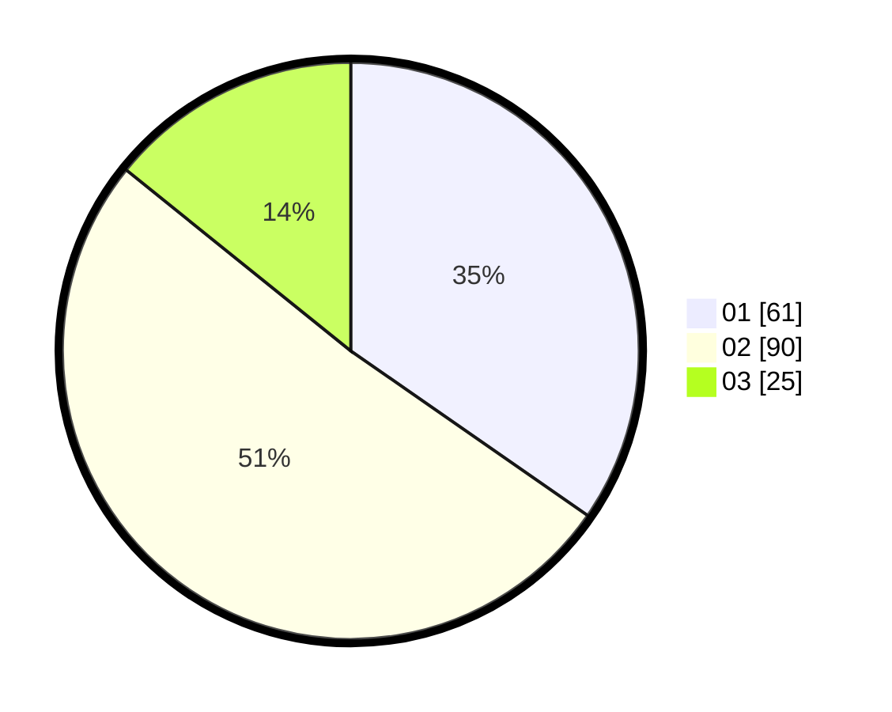

# Hasil

Hasil perolehan suara paslon dapat dilihat pada file paslon-01.txt, paslon-02.txt, dan paslon-03.txt.

Jika tidak ada, artinya data tersebut belum ada pada SIREKAP.

## Perolehan Suara

 * Paslon 01: **61**.
 * Paslon 02: **90**.
 * Paslon 03: **25**.

## Foto C Plano

https://sirekap-obj-formc.kpu.go.id/1b53/pemilu/ppwp/31/73/01/10/06/3173011006059-20240215-231150--b4ceccbd-9d0c-4377-8864-3e295f32590a.jpg

https://sirekap-obj-formc.kpu.go.id/1b53/pemilu/ppwp/31/73/01/10/06/3173011006059-20240215-231153--00ac203f-97fe-4814-8fec-61e84a5db683.jpg

https://sirekap-obj-formc.kpu.go.id/1b53/pemilu/ppwp/31/73/01/10/06/3173011006059-20240215-231152--7585d7b9-c32c-4c90-995b-f494e2eec0ab.jpg

## DATA PEMILIH TETAP

Jumlah pemilih dalam DPT: **285**.
 * L: **145**.
 * P: **140**.

## DATA PENGGUNA HAK PILIH

Jumlah pengguna hak pilih dalam DPT: **285**.
 * L: **145**.
 * P: **140**.

Jumlah pengguna hak pilih dalam DPTb: **0**.
 * L: **0**.
 * P: **0**.

Jumlah pengguna hak pilih dalam DPK: **0**.
 * L: **0**.
 * P: **0**.

Jumlah pengguna hak pilih: **285**.
 * L: **145**.
 * P: **140**.

## JUMLAH SUARA SAH DAN TIDAK SAH

JUMLAH SELURUH SUARA SAH: **176**.

JUMLAH SUARA TIDAK SAH: **7**.

JUMLAH SELURUH SUARA SAH DAN SUARA TIDAK SAH: **183**.
