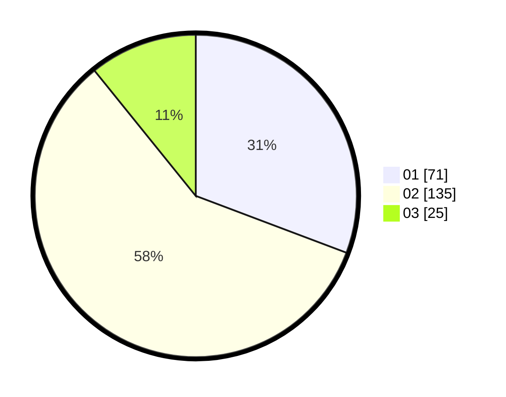

# Hasil

Hasil perolehan suara paslon dapat dilihat pada file paslon-01.txt, paslon-02.txt, dan paslon-03.txt.

Jika tidak ada, artinya data tersebut belum ada pada SIREKAP.

## Perolehan Suara

 * Paslon 01: **71**.
 * Paslon 02: **135**.
 * Paslon 03: **25**.

## Foto C Plano

https://sirekap-obj-formc.kpu.go.id/19fe/pemilu/ppwp/31/73/01/10/06/3173011006061-20240216-000512--2df82b67-8f82-4902-b6f5-117774e67b58.jpg

https://sirekap-obj-formc.kpu.go.id/19fe/pemilu/ppwp/31/73/01/10/06/3173011006061-20240216-000515--02c649df-a8d8-4569-87e9-ddbd85516f80.jpg

https://sirekap-obj-formc.kpu.go.id/19fe/pemilu/ppwp/31/73/01/10/06/3173011006061-20240214-191221--e32b1240-6b3a-4e1e-ac9c-ff1a21150505.jpg

## DATA PEMILIH TETAP

Jumlah pemilih dalam DPT: **285**.
 * L: **136**.
 * P: **149**.

## DATA PENGGUNA HAK PILIH

Jumlah pengguna hak pilih dalam DPT: **231**.
 * L: **110**.
 * P: **121**.

Jumlah pengguna hak pilih dalam DPTb: **0**.
 * L: **0**.
 * P: **0**.

Jumlah pengguna hak pilih dalam DPK: **1**.
 * L: **1**.
 * P: **0**.

Jumlah pengguna hak pilih: **232**.
 * L: **111**.
 * P: **121**.

## JUMLAH SUARA SAH DAN TIDAK SAH

JUMLAH SELURUH SUARA SAH: **231**.

JUMLAH SUARA TIDAK SAH: **1**.

JUMLAH SELURUH SUARA SAH DAN SUARA TIDAK SAH: **232**.
