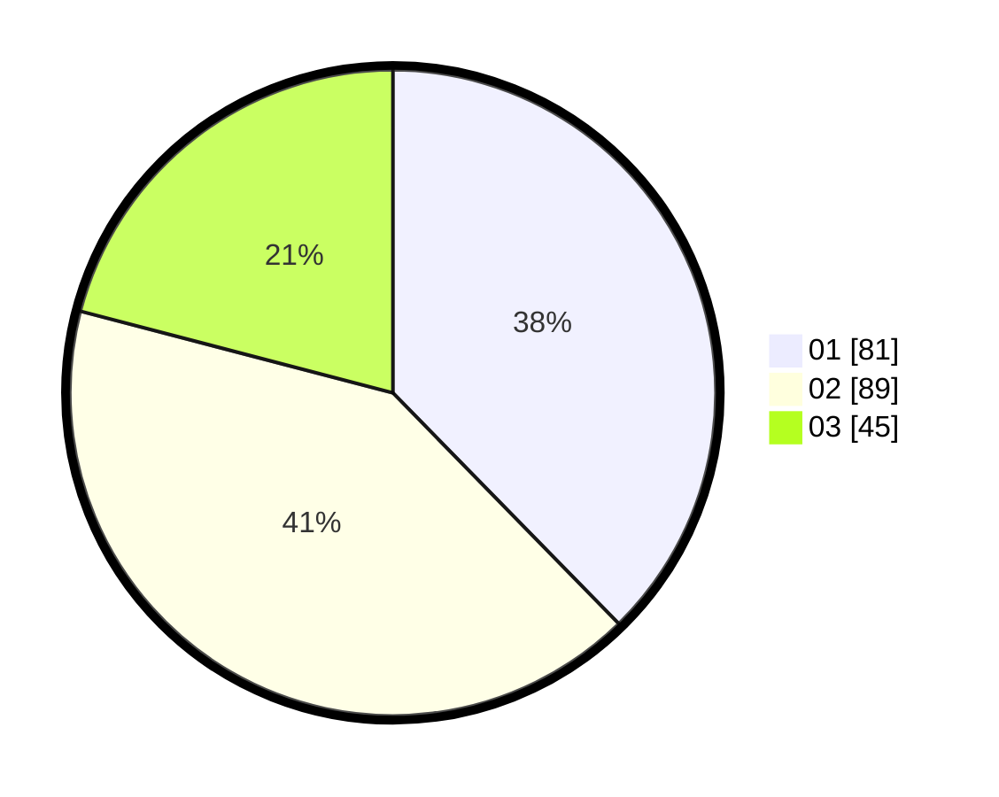

# Hasil

Hasil perolehan suara paslon dapat dilihat pada file paslon-01.txt, paslon-02.txt, dan paslon-03.txt.

Jika tidak ada, artinya data tersebut belum ada pada SIREKAP.

## Perolehan Suara

 * Paslon 01: **81**.
 * Paslon 02: **89**.
 * Paslon 03: **45**.

## Foto C Plano

https://sirekap-obj-formc.kpu.go.id/8465/pemilu/ppwp/31/73/01/10/06/3173011006065-20240214-190033--b7fff76a-d27d-4fd2-ba5d-d571c394f97d.jpg

https://sirekap-obj-formc.kpu.go.id/8465/pemilu/ppwp/31/73/01/10/06/3173011006065-20240214-185852--3d082947-19a2-4fa4-aafe-130dcdaabd76.jpg
