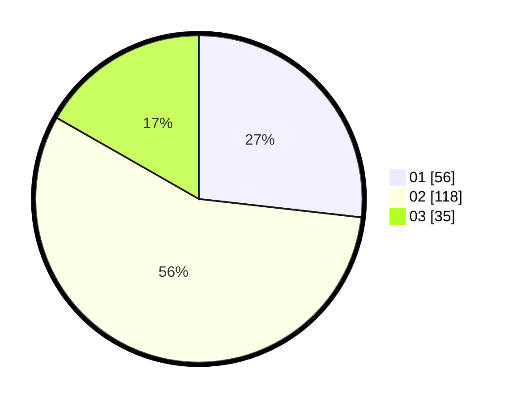

# Hasil

Hasil perolehan suara paslon dapat dilihat pada file paslon-01.txt, paslon-02.txt, dan paslon-03.txt.

Jika tidak ada, artinya data tersebut belum ada pada SIREKAP.

## Perolehan Suara

 * Paslon 01: **56**.
 * Paslon 02: **118**.
 * Paslon 03: **35**.

## Foto C Plano

https://sirekap-obj-formc.kpu.go.id/e096/pemilu/ppwp/31/73/01/10/06/3173011006067-20240215-005441--237eb495-0c26-44da-85af-53c102da3902.jpg

https://sirekap-obj-formc.kpu.go.id/e096/pemilu/ppwp/31/73/01/10/06/3173011006067-20240215-010330--3b79d6ce-92bc-4853-8748-b6dc5005a910.jpg

https://sirekap-obj-formc.kpu.go.id/e096/pemilu/ppwp/31/73/01/10/06/3173011006067-20240215-005246--073b1789-5644-4cf4-b94d-a412c4aacc35.jpg
