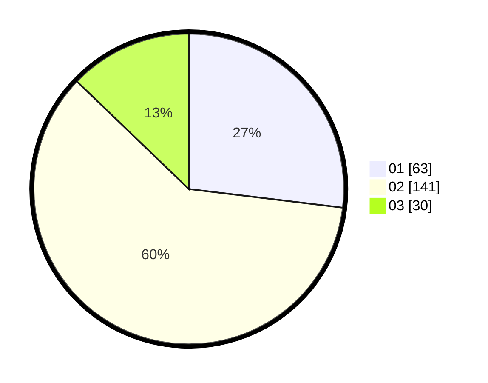

# Hasil

Hasil perolehan suara paslon dapat dilihat pada file paslon-01.txt, paslon-02.txt, dan paslon-03.txt.

Jika tidak ada, artinya data tersebut belum ada pada SIREKAP.

## Perolehan Suara

 * Paslon 01: **63**.
 * Paslon 02: **141**.
 * Paslon 03: **30**.

## Foto C Plano

https://sirekap-obj-formc.kpu.go.id/c454/pemilu/ppwp/31/73/01/10/06/3173011006069-20240214-200251--8188b628-8cc7-4246-8a3d-471c218a3bf1.jpg

https://sirekap-obj-formc.kpu.go.id/c454/pemilu/ppwp/31/73/01/10/06/3173011006069-20240214-200257--847a2cbe-7841-4dd7-ab23-19d8b0dc6c3e.jpg

https://sirekap-obj-formc.kpu.go.id/c454/pemilu/ppwp/31/73/01/10/06/3173011006069-20240214-203019--7afa3ce2-fa04-47f8-ac69-fd66092edcd1.jpg

## DATA PEMILIH TETAP

Jumlah pemilih dalam DPT: **280**.
 * L: **132**.
 * P: **148**.

## DATA PENGGUNA HAK PILIH

Jumlah pengguna hak pilih dalam DPT: **233**.
 * L: **106**.
 * P: **127**.

Jumlah pengguna hak pilih dalam DPTb: **0**.
 * L: **0**.
 * P: **0**.

Jumlah pengguna hak pilih dalam DPK: **3**.
 * L: **2**.
 * P: **1**.

Jumlah pengguna hak pilih: **236**.
 * L: **108**.
 * P: **128**.

## JUMLAH SUARA SAH DAN TIDAK SAH

JUMLAH SELURUH SUARA SAH: **234**.

JUMLAH SUARA TIDAK SAH: **2**.

JUMLAH SELURUH SUARA SAH DAN SUARA TIDAK SAH: **236**.
