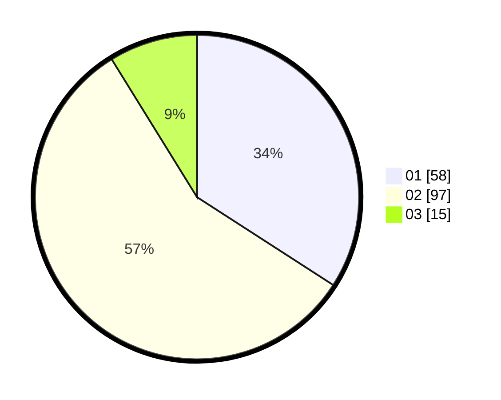

# Hasil

Hasil perolehan suara paslon dapat dilihat pada file paslon-01.txt, paslon-02.txt, dan paslon-03.txt.

Jika tidak ada, artinya data tersebut belum ada pada SIREKAP.

## Perolehan Suara

 * Paslon 01: **58**.
 * Paslon 02: **97**.
 * Paslon 03: **15**.

## Foto C Plano

https://sirekap-obj-formc.kpu.go.id/fab2/pemilu/ppwp/31/73/01/10/06/3173011006071-20240215-223634--1201ca26-fa39-4a81-b862-5d026421c039.jpg

https://sirekap-obj-formc.kpu.go.id/fab2/pemilu/ppwp/31/73/01/10/06/3173011006071-20240215-223636--5299d6a4-dfc4-4762-9b8d-d244327ad0a7.jpg

https://sirekap-obj-formc.kpu.go.id/fab2/pemilu/ppwp/31/73/01/10/06/3173011006071-20240215-223635--6c2d2e6b-6d1e-49c4-8317-65c4a98de91e.jpg

## DATA PEMILIH TETAP

Jumlah pemilih dalam DPT: **213**.
 * L: **98**.
 * P: **115**.

## DATA PENGGUNA HAK PILIH

Jumlah pengguna hak pilih dalam DPT: **172**.
 * L: **77**.
 * P: **95**.

Jumlah pengguna hak pilih dalam DPTb: **0**.
 * L: **0**.
 * P: **0**.

Jumlah pengguna hak pilih dalam DPK: **0**.
 * L: **0**.
 * P: **0**.

Jumlah pengguna hak pilih: **172**.
 * L: **77**.
 * P: **95**.

## JUMLAH SUARA SAH DAN TIDAK SAH

JUMLAH SELURUH SUARA SAH: **170**.

JUMLAH SUARA TIDAK SAH: **2**.

JUMLAH SELURUH SUARA SAH DAN SUARA TIDAK SAH: **172**.
