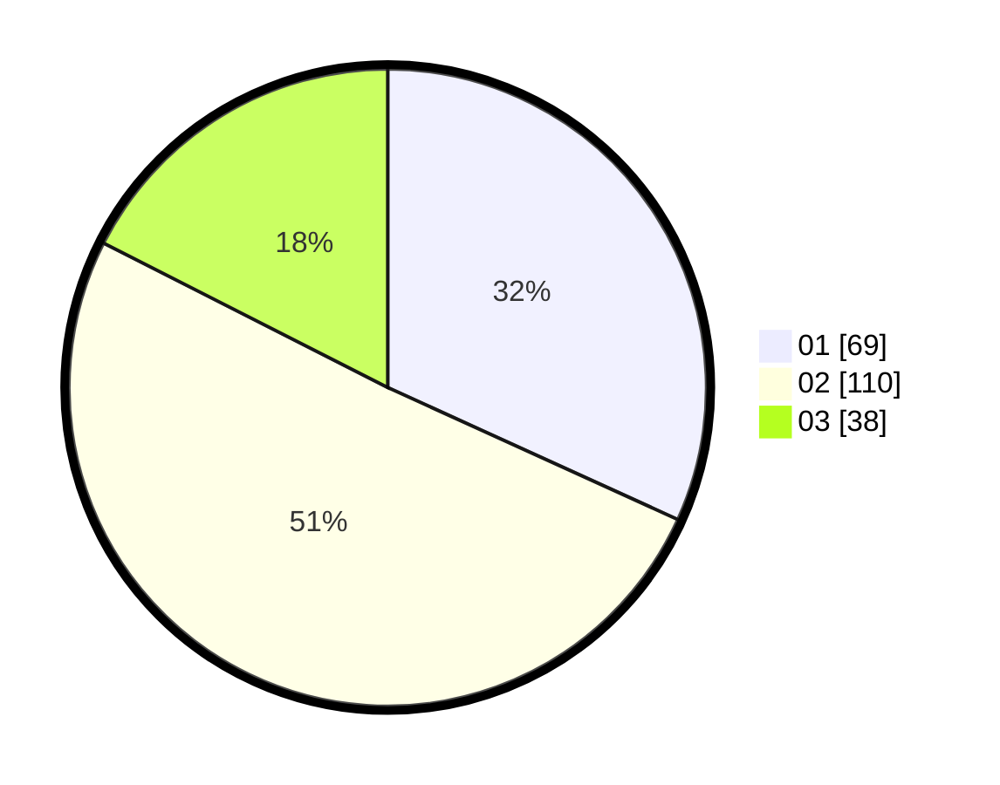

# Hasil

Hasil perolehan suara paslon dapat dilihat pada file paslon-01.txt, paslon-02.txt, dan paslon-03.txt.

Jika tidak ada, artinya data tersebut belum ada pada SIREKAP.

## Perolehan Suara

 * Paslon 01: **69**.
 * Paslon 02: **110**.
 * Paslon 03: **38**.

## Foto C Plano

https://sirekap-obj-formc.kpu.go.id/d3de/pemilu/ppwp/31/73/01/10/06/3173011006072-20240216-012919--1daa22c7-a677-43aa-86f1-2fa66d3198b9.jpg

https://sirekap-obj-formc.kpu.go.id/d3de/pemilu/ppwp/31/73/01/10/06/3173011006072-20240216-020930--f6edd6e4-c4d7-48e9-bbb2-f4947ec0b4c0.jpg

https://sirekap-obj-formc.kpu.go.id/d3de/pemilu/ppwp/31/73/01/10/06/3173011006072-20240216-012927--a21d27cd-8603-45a7-a0c4-fcac06bf8174.jpg

## DATA PEMILIH TETAP

Jumlah pemilih dalam DPT: **285**.
 * L: **144**.
 * P: **141**.

## DATA PENGGUNA HAK PILIH

Jumlah pengguna hak pilih dalam DPT: **217**.
 * L: **108**.
 * P: **109**.

Jumlah pengguna hak pilih dalam DPTb: **0**.
 * L: **0**.
 * P: **0**.

Jumlah pengguna hak pilih dalam DPK: **3**.
 * L: **2**.
 * P: **1**.

Jumlah pengguna hak pilih: **220**.
 * L: **110**.
 * P: **110**.

## JUMLAH SUARA SAH DAN TIDAK SAH

JUMLAH SELURUH SUARA SAH: **217**.

JUMLAH SUARA TIDAK SAH: **3**.

JUMLAH SELURUH SUARA SAH DAN SUARA TIDAK SAH: **220**.
