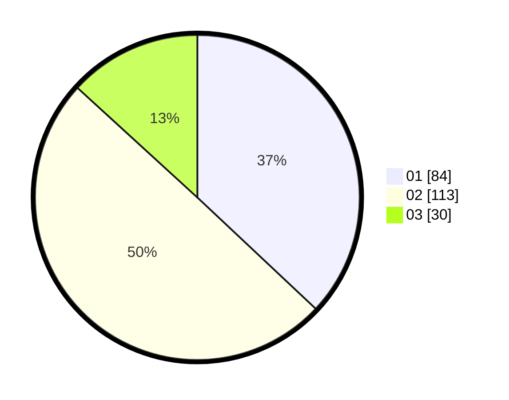

# Hasil

Hasil perolehan suara paslon dapat dilihat pada file paslon-01.txt, paslon-02.txt, dan paslon-03.txt.

Jika tidak ada, artinya data tersebut belum ada pada SIREKAP.

## Perolehan Suara

 * Paslon 01: **84**.
 * Paslon 02: **113**.
 * Paslon 03: **30**.

## Foto C Plano

https://sirekap-obj-formc.kpu.go.id/59f9/pemilu/ppwp/31/73/01/10/06/3173011006075-20240215-224839--91797904-9ca0-4d9f-9a42-f9dd33e7be84.jpg

https://sirekap-obj-formc.kpu.go.id/59f9/pemilu/ppwp/31/73/01/10/06/3173011006075-20240215-224842--26faa8a3-35a0-40ae-97f7-3d44de97a474.jpg

https://sirekap-obj-formc.kpu.go.id/59f9/pemilu/ppwp/31/73/01/10/06/3173011006075-20240215-224841--3dd5f4f6-7e69-4fa6-99bc-94d511b6f213.jpg

## DATA PEMILIH TETAP

Jumlah pemilih dalam DPT: **284**.
 * L: **141**.
 * P: **143**.

## DATA PENGGUNA HAK PILIH

Jumlah pengguna hak pilih dalam DPT: **223**.
 * L: **108**.
 * P: **115**.

Jumlah pengguna hak pilih dalam DPTb: **0**.
 * L: **0**.
 * P: **0**.

Jumlah pengguna hak pilih dalam DPK: **7**.
 * L: **5**.
 * P: **2**.

Jumlah pengguna hak pilih: **230**.
 * L: **113**.
 * P: **117**.

## JUMLAH SUARA SAH DAN TIDAK SAH

JUMLAH SELURUH SUARA SAH: **227**.

JUMLAH SUARA TIDAK SAH: **3**.

JUMLAH SELURUH SUARA SAH DAN SUARA TIDAK SAH: **230**.
