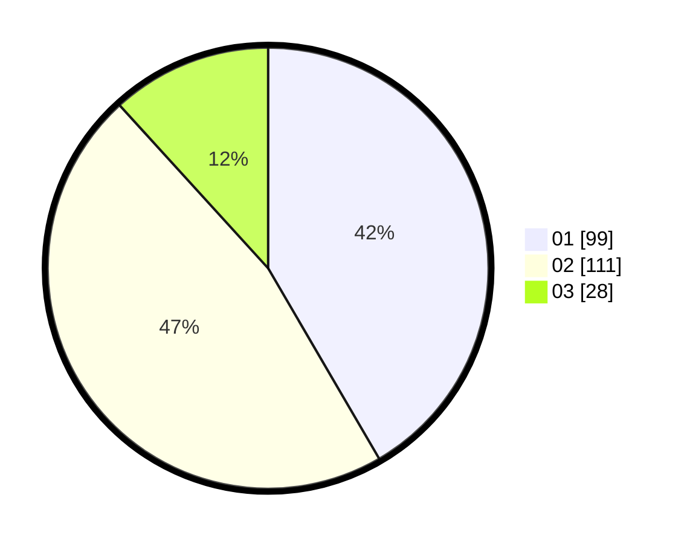

# Hasil

Hasil perolehan suara paslon dapat dilihat pada file paslon-01.txt, paslon-02.txt, dan paslon-03.txt.

Jika tidak ada, artinya data tersebut belum ada pada SIREKAP.

## Perolehan Suara

 * Paslon 01: **99**.
 * Paslon 02: **111**.
 * Paslon 03: **28**.

## Foto C Plano

https://sirekap-obj-formc.kpu.go.id/b930/pemilu/ppwp/31/73/01/10/06/3173011006078-20240216-090603--c5ef789d-8df6-48d2-81d3-6ab34f055f43.jpg

https://sirekap-obj-formc.kpu.go.id/b930/pemilu/ppwp/31/73/01/10/06/3173011006078-20240216-092319--798a1bc2-fe5f-4dee-858e-5eaa70e97c11.jpg

https://sirekap-obj-formc.kpu.go.id/b930/pemilu/ppwp/31/73/01/10/06/3173011006078-20240216-090604--4448d3c3-781e-400c-b025-15707a787531.jpg

## DATA PEMILIH TETAP

Jumlah pemilih dalam DPT: **289**.
 * L: **152**.
 * P: **137**.

## DATA PENGGUNA HAK PILIH

Jumlah pengguna hak pilih dalam DPT: **232**.
 * L: **115**.
 * P: **117**.

Jumlah pengguna hak pilih dalam DPTb: **0**.
 * L: **0**.
 * P: **0**.

Jumlah pengguna hak pilih dalam DPK: **8**.
 * L: **5**.
 * P: **3**.

Jumlah pengguna hak pilih: **240**.
 * L: **120**.
 * P: **120**.

## JUMLAH SUARA SAH DAN TIDAK SAH

JUMLAH SELURUH SUARA SAH: **238**.

JUMLAH SUARA TIDAK SAH: **2**.

JUMLAH SELURUH SUARA SAH DAN SUARA TIDAK SAH: **240**.
