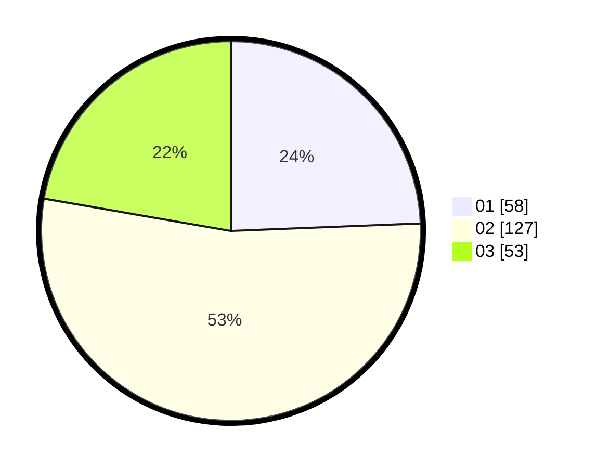

# Hasil

Hasil perolehan suara paslon dapat dilihat pada file paslon-01.txt, paslon-02.txt, dan paslon-03.txt.

Jika tidak ada, artinya data tersebut belum ada pada SIREKAP.

## Perolehan Suara

 * Paslon 01: **58**.
 * Paslon 02: **127**.
 * Paslon 03: **53**.

## Foto C Plano

https://sirekap-obj-formc.kpu.go.id/047f/pemilu/ppwp/31/73/01/10/06/3173011006083-20240215-014714--42653cee-9217-4401-81f0-6a5dab12150b.jpg

https://sirekap-obj-formc.kpu.go.id/047f/pemilu/ppwp/31/73/01/10/06/3173011006083-20240214-215522--2d7dd561-27db-455a-92f3-177f54d6adc0.jpg

https://sirekap-obj-formc.kpu.go.id/047f/pemilu/ppwp/31/73/01/10/06/3173011006083-20240214-215621--4098ded0-22b9-41e6-b17d-ca1097673754.jpg
