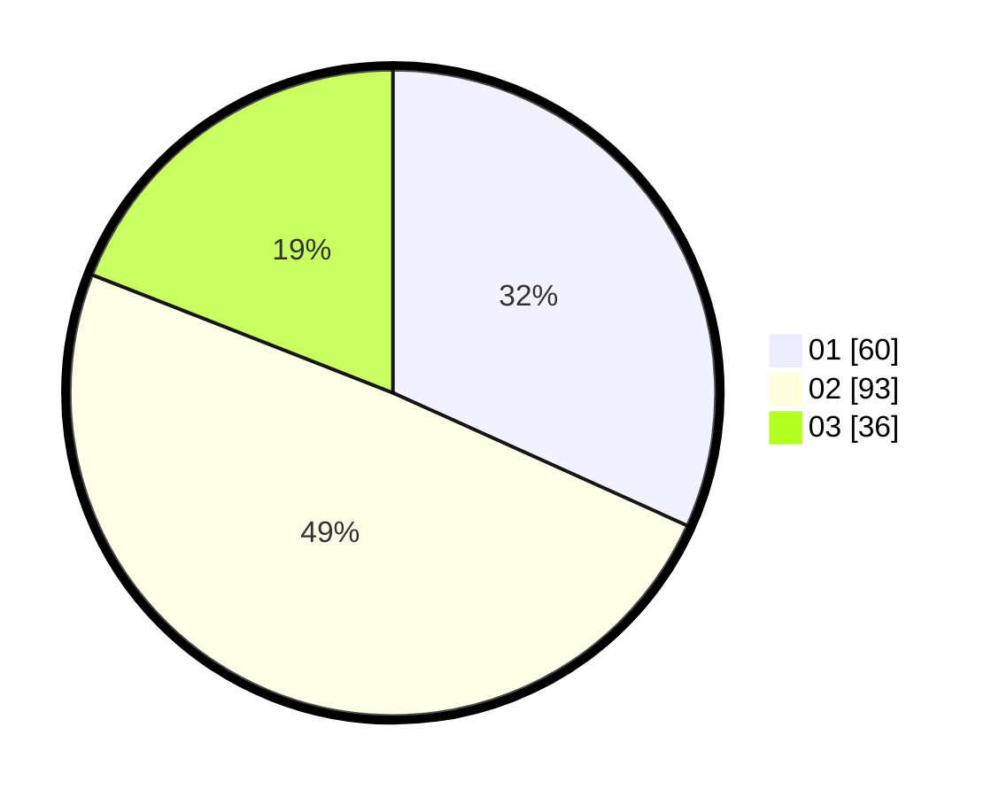

# Hasil

Hasil perolehan suara paslon dapat dilihat pada file paslon-01.txt, paslon-02.txt, dan paslon-03.txt.

Jika tidak ada, artinya data tersebut belum ada pada SIREKAP.

## Perolehan Suara

 * Paslon 01: **60**.
 * Paslon 02: **93**.
 * Paslon 03: **36**.

## Foto C Plano

https://sirekap-obj-formc.kpu.go.id/1e95/pemilu/ppwp/31/73/01/10/06/3173011006084-20240214-234901--0c877fa4-bd46-4705-85f7-7fe5f518b601.jpg

https://sirekap-obj-formc.kpu.go.id/1e95/pemilu/ppwp/31/73/01/10/06/3173011006084-20240214-213928--8791412a-8822-4114-917d-07af41eba79f.jpg

https://sirekap-obj-formc.kpu.go.id/1e95/pemilu/ppwp/31/73/01/10/06/3173011006084-20240214-214159--76637a97-b27a-4245-bf76-330c0f052f69.jpg
