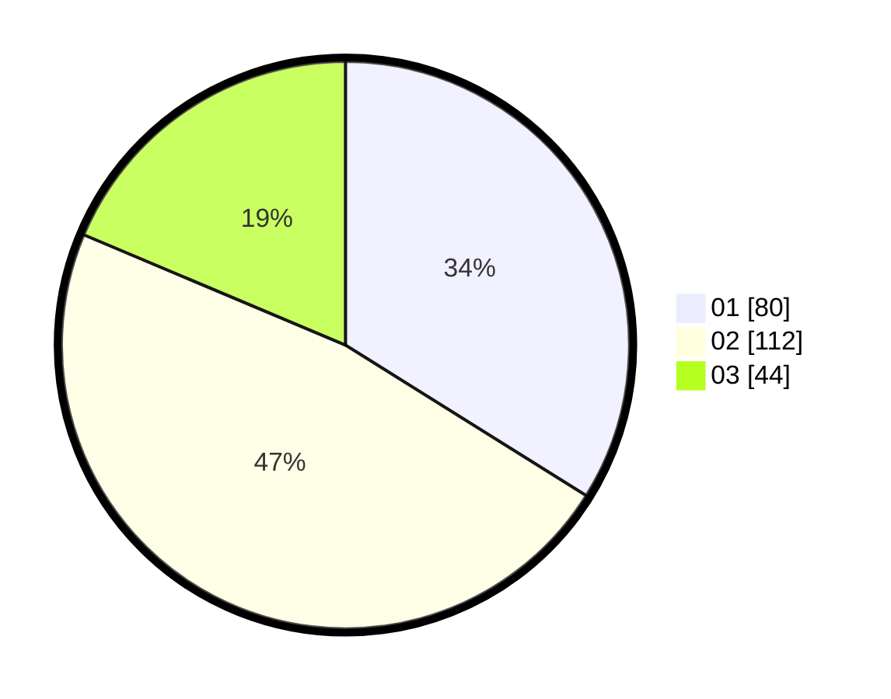

# Hasil

Hasil perolehan suara paslon dapat dilihat pada file paslon-01.txt, paslon-02.txt, dan paslon-03.txt.

Jika tidak ada, artinya data tersebut belum ada pada SIREKAP.

## Perolehan Suara

 * Paslon 01: **80**.
 * Paslon 02: **112**.
 * Paslon 03: **44**.

## Foto C Plano

https://sirekap-obj-formc.kpu.go.id/63c0/pemilu/ppwp/31/73/01/10/06/3173011006085-20240215-001626--c76da887-783a-4403-bf70-001a62cb04ad.jpg

https://sirekap-obj-formc.kpu.go.id/63c0/pemilu/ppwp/31/73/01/10/06/3173011006085-20240214-191544--0e89b65d-fc27-490d-841c-2cdc76a9da8c.jpg

https://sirekap-obj-formc.kpu.go.id/63c0/pemilu/ppwp/31/73/01/10/06/3173011006085-20240215-002021--4269414b-3124-4446-9cd2-d509cbd59333.jpg
