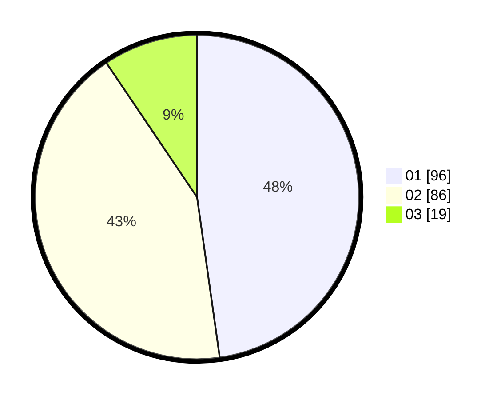

# Hasil

Hasil perolehan suara paslon dapat dilihat pada file paslon-01.txt, paslon-02.txt, dan paslon-03.txt.

Jika tidak ada, artinya data tersebut belum ada pada SIREKAP.

## Perolehan Suara

 * Paslon 01: **96**.
 * Paslon 02: **86**.
 * Paslon 03: **19**.

## Foto C Plano

https://sirekap-obj-formc.kpu.go.id/38f1/pemilu/ppwp/31/73/01/10/06/3173011006087-20240214-234907--07654d00-0343-4274-a4a1-d3115d792c57.jpg

https://sirekap-obj-formc.kpu.go.id/38f1/pemilu/ppwp/31/73/01/10/06/3173011006087-20240214-235044--5420b1df-9593-481a-82cc-a5ba97e75054.jpg

https://sirekap-obj-formc.kpu.go.id/38f1/pemilu/ppwp/31/73/01/10/06/3173011006087-20240214-235300--c52f4e13-607b-4cca-ada2-f2e270722374.jpg

## DATA PEMILIH TETAP

Jumlah pemilih dalam DPT: **267**.
 * L: **135**.
 * P: **132**.

## DATA PENGGUNA HAK PILIH

Jumlah pengguna hak pilih dalam DPT: **201**.
 * L: **108**.
 * P: **93**.

Jumlah pengguna hak pilih dalam DPTb: **1**.
 * L: **1**.
 * P: **0**.

Jumlah pengguna hak pilih dalam DPK: **0**.
 * L: **0**.
 * P: **0**.

Jumlah pengguna hak pilih: **202**.
 * L: **109**.
 * P: **93**.

## JUMLAH SUARA SAH DAN TIDAK SAH

JUMLAH SELURUH SUARA SAH: **201**.

JUMLAH SUARA TIDAK SAH: **1**.

JUMLAH SELURUH SUARA SAH DAN SUARA TIDAK SAH: **202**.
