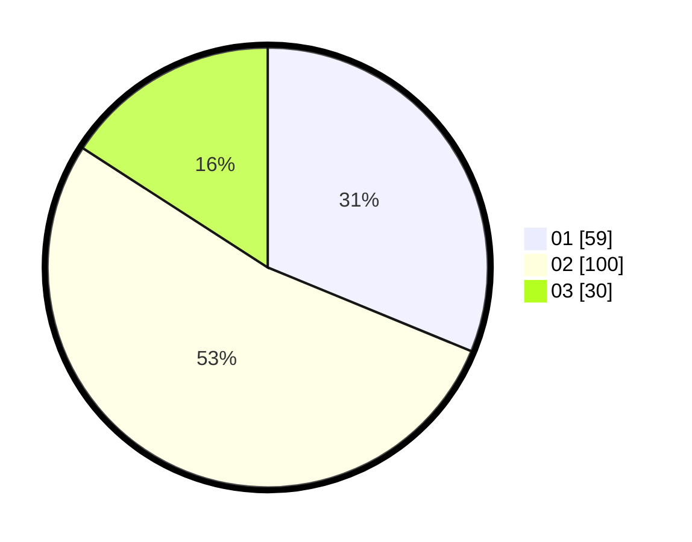

# Hasil

Hasil perolehan suara paslon dapat dilihat pada file paslon-01.txt, paslon-02.txt, dan paslon-03.txt.

Jika tidak ada, artinya data tersebut belum ada pada SIREKAP.

## Perolehan Suara

 * Paslon 01: **59**.
 * Paslon 02: **100**.
 * Paslon 03: **30**.

## Foto C Plano

https://sirekap-obj-formc.kpu.go.id/64d2/pemilu/ppwp/31/73/01/10/06/3173011006089-20240214-221811--5794f91c-15ab-47b6-abe8-48066230ebf4.jpg

https://sirekap-obj-formc.kpu.go.id/64d2/pemilu/ppwp/31/73/01/10/06/3173011006089-20240214-222236--022bce1a-0a39-422d-b164-ea5f6346d0ce.jpg

https://sirekap-obj-formc.kpu.go.id/64d2/pemilu/ppwp/31/73/01/10/06/3173011006089-20240214-222347--0eccb0ef-48e3-4433-a582-6a2b43016029.jpg

## DATA PEMILIH TETAP

Jumlah pemilih dalam DPT: **277**.
 * L: **140**.
 * P: **137**.

## DATA PENGGUNA HAK PILIH

Jumlah pengguna hak pilih dalam DPT: **186**.
 * L: **91**.
 * P: **95**.

Jumlah pengguna hak pilih dalam DPTb: **0**.
 * L: **0**.
 * P: **0**.

Jumlah pengguna hak pilih dalam DPK: **6**.
 * L: **3**.
 * P: **3**.

Jumlah pengguna hak pilih: **192**.
 * L: **94**.
 * P: **98**.

## JUMLAH SUARA SAH DAN TIDAK SAH

JUMLAH SELURUH SUARA SAH: **189**.

JUMLAH SUARA TIDAK SAH: **3**.

JUMLAH SELURUH SUARA SAH DAN SUARA TIDAK SAH: **192**.
