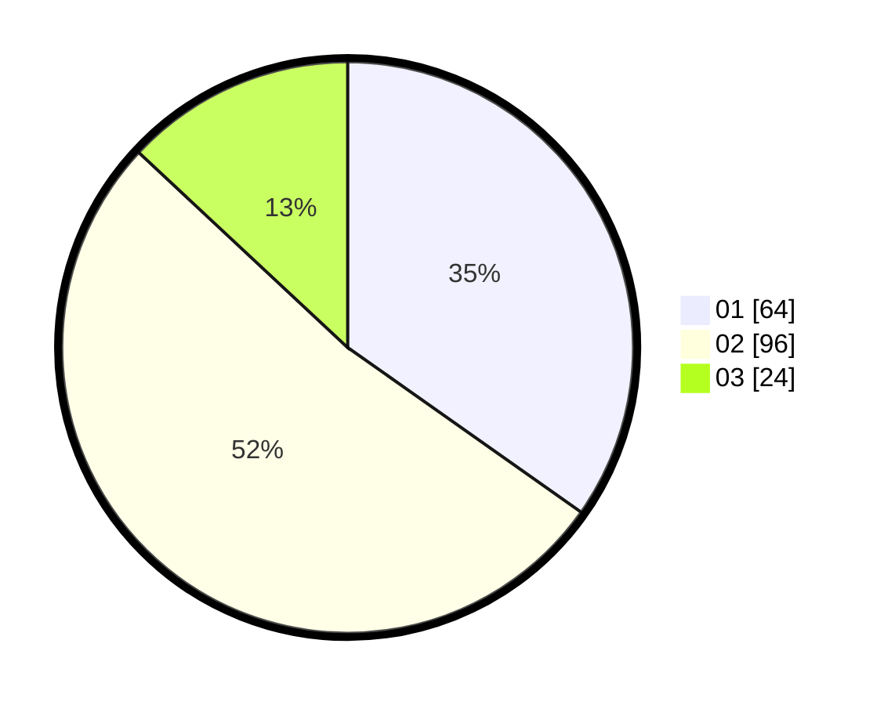

# Hasil

Hasil perolehan suara paslon dapat dilihat pada file paslon-01.txt, paslon-02.txt, dan paslon-03.txt.

Jika tidak ada, artinya data tersebut belum ada pada SIREKAP.

## Perolehan Suara

 * Paslon 01: **64**.
 * Paslon 02: **96**.
 * Paslon 03: **24**.

## Foto C Plano

https://sirekap-obj-formc.kpu.go.id/3560/pemilu/ppwp/31/73/01/10/06/3173011006090-20240214-222926--9c8c0e0b-474b-433e-8fa4-88a34613780c.jpg

https://sirekap-obj-formc.kpu.go.id/3560/pemilu/ppwp/31/73/01/10/06/3173011006090-20240214-223006--362aaf55-a10d-481e-a1cd-2f6a00b6bb9c.jpg

https://sirekap-obj-formc.kpu.go.id/3560/pemilu/ppwp/31/73/01/10/06/3173011006090-20240214-223043--3ef5ef66-f0b0-42dc-8027-ef01945bfbba.jpg

## DATA PEMILIH TETAP

Jumlah pemilih dalam DPT: **288**.
 * L: **137**.
 * P: **151**.

## DATA PENGGUNA HAK PILIH

Jumlah pengguna hak pilih dalam DPT: **203**.
 * L: **88**.
 * P: **115**.

Jumlah pengguna hak pilih dalam DPTb: **0**.
 * L: **0**.
 * P: **0**.

Jumlah pengguna hak pilih dalam DPK: **0**.
 * L: **0**.
 * P: **0**.

Jumlah pengguna hak pilih: **203**.
 * L: **88**.
 * P: **115**.

## JUMLAH SUARA SAH DAN TIDAK SAH

JUMLAH SELURUH SUARA SAH: **184**.

JUMLAH SUARA TIDAK SAH: **19**.

JUMLAH SELURUH SUARA SAH DAN SUARA TIDAK SAH: **203**.
