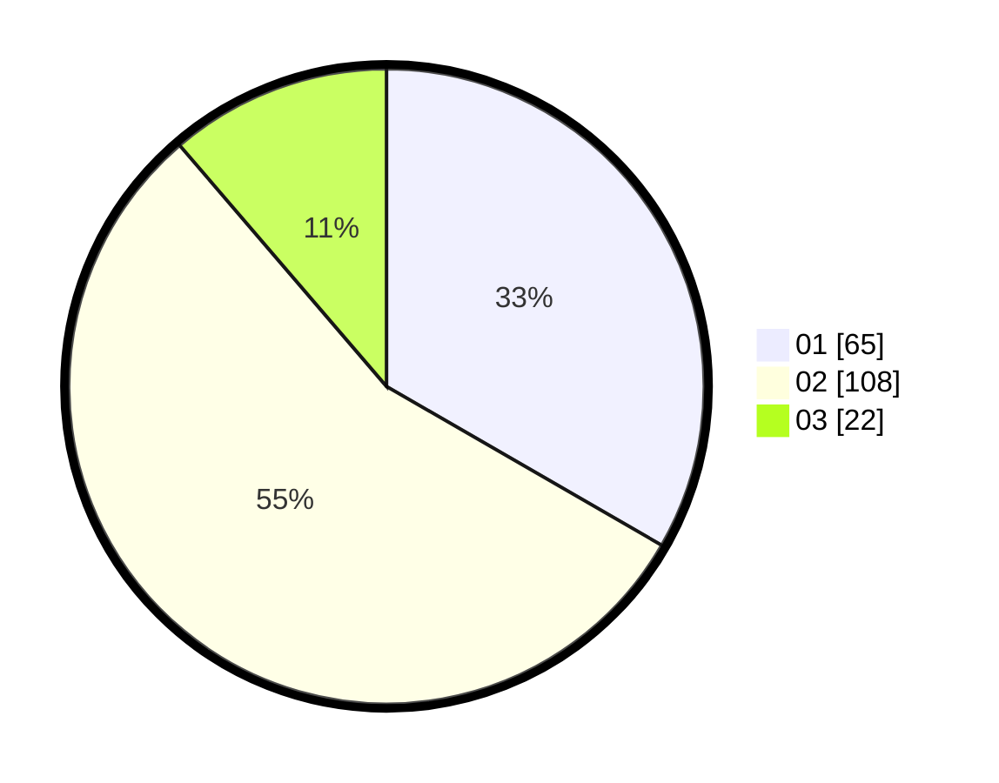

# Hasil

Hasil perolehan suara paslon dapat dilihat pada file paslon-01.txt, paslon-02.txt, dan paslon-03.txt.

Jika tidak ada, artinya data tersebut belum ada pada SIREKAP.

## Perolehan Suara

 * Paslon 01: **65**.
 * Paslon 02: **108**.
 * Paslon 03: **22**.

## Foto C Plano

https://sirekap-obj-formc.kpu.go.id/c0af/pemilu/ppwp/31/73/01/10/06/3173011006094-20240216-042101--5c9a120f-3db8-4ec8-bdaf-9241c259e3ab.jpg

https://sirekap-obj-formc.kpu.go.id/c0af/pemilu/ppwp/31/73/01/10/06/3173011006094-20240216-071929--1e2ab012-12eb-4ac2-9244-caae673a2fa6.jpg

https://sirekap-obj-formc.kpu.go.id/c0af/pemilu/ppwp/31/73/01/10/06/3173011006094-20240216-042103--e25803b4-876b-45b5-8a15-fe115be29b8b.jpg

## DATA PEMILIH TETAP

Jumlah pemilih dalam DPT: **282**.
 * L: **141**.
 * P: **141**.

## DATA PENGGUNA HAK PILIH

Jumlah pengguna hak pilih dalam DPT: **198**.
 * L: **94**.
 * P: **104**.

Jumlah pengguna hak pilih dalam DPTb: **0**.
 * L: **0**.
 * P: **0**.

Jumlah pengguna hak pilih dalam DPK: **0**.
 * L: **0**.
 * P: **0**.

Jumlah pengguna hak pilih: **198**.
 * L: **94**.
 * P: **104**.

## JUMLAH SUARA SAH DAN TIDAK SAH

JUMLAH SELURUH SUARA SAH: **195**.

JUMLAH SUARA TIDAK SAH: **3**.

JUMLAH SELURUH SUARA SAH DAN SUARA TIDAK SAH: **198**.
