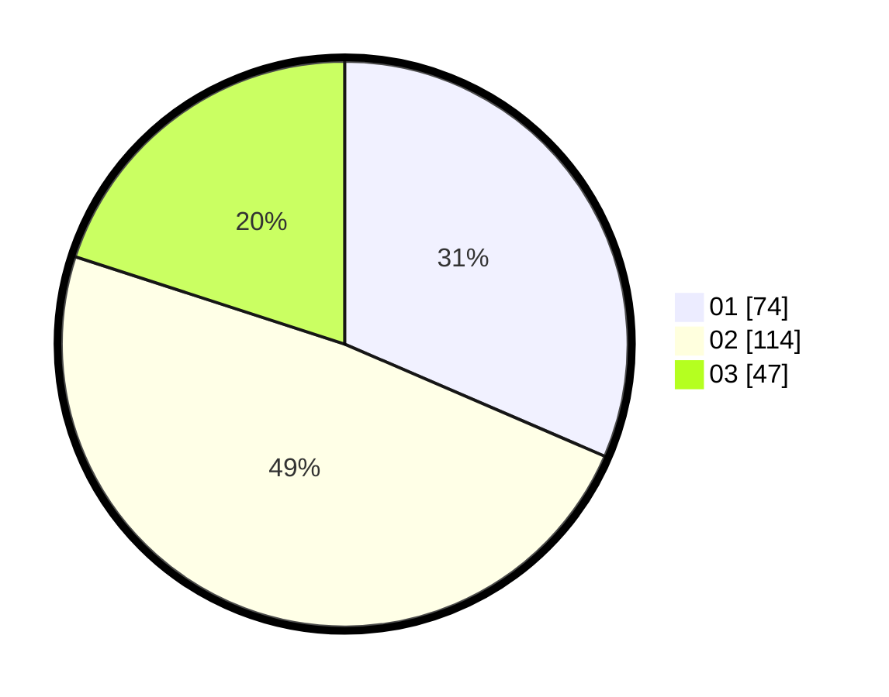

# Hasil

Hasil perolehan suara paslon dapat dilihat pada file paslon-01.txt, paslon-02.txt, dan paslon-03.txt.

Jika tidak ada, artinya data tersebut belum ada pada SIREKAP.

## Perolehan Suara

 * Paslon 01: **74**.
 * Paslon 02: **114**.
 * Paslon 03: **47**.

## Foto C Plano

https://sirekap-obj-formc.kpu.go.id/7be0/pemilu/ppwp/31/73/01/10/06/3173011006096-20240215-215323--e4b98110-ec88-4f8e-ac7f-d0c212fa1fbf.jpg

https://sirekap-obj-formc.kpu.go.id/7be0/pemilu/ppwp/31/73/01/10/06/3173011006096-20240215-215325--c61ecf32-5016-4aa8-9d9a-6409debec4b9.jpg

https://sirekap-obj-formc.kpu.go.id/7be0/pemilu/ppwp/31/73/01/10/06/3173011006096-20240215-215324--f5e0946c-4b9e-474c-bce2-c8ffbd65a3f8.jpg

## DATA PEMILIH TETAP

Jumlah pemilih dalam DPT: **288**.
 * L: **142**.
 * P: **146**.

## DATA PENGGUNA HAK PILIH

Jumlah pengguna hak pilih dalam DPT: **233**.
 * L: **113**.
 * P: **120**.

Jumlah pengguna hak pilih dalam DPTb: **5**.
 * L: **5**.
 * P: **0**.

Jumlah pengguna hak pilih dalam DPK: **1**.
 * L: **0**.
 * P: **1**.

Jumlah pengguna hak pilih: **239**.
 * L: **118**.
 * P: **121**.

## JUMLAH SUARA SAH DAN TIDAK SAH

JUMLAH SELURUH SUARA SAH: **235**.

JUMLAH SUARA TIDAK SAH: **4**.

JUMLAH SELURUH SUARA SAH DAN SUARA TIDAK SAH: **239**.
