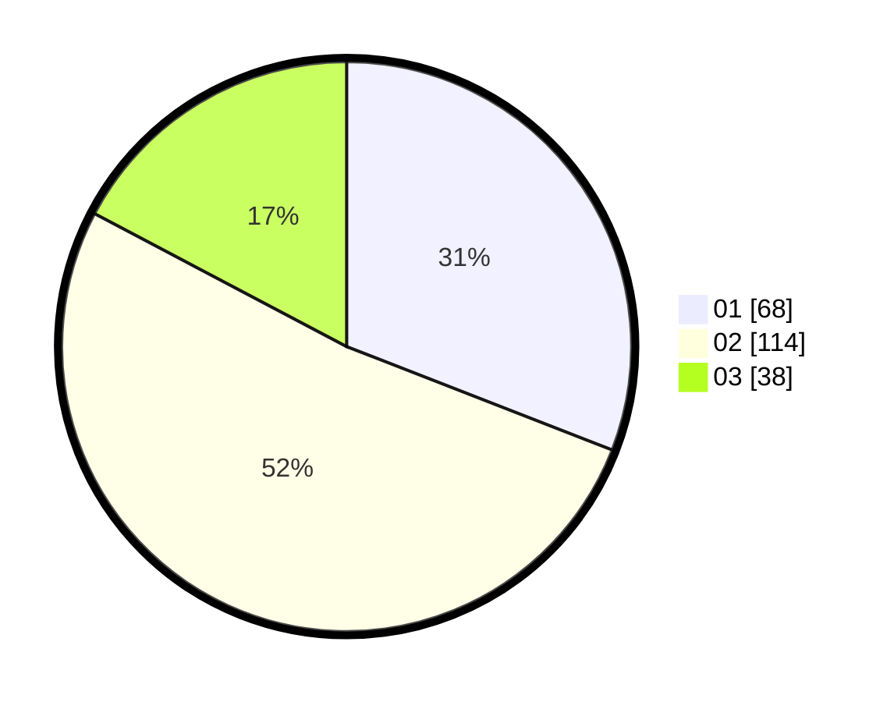

# Hasil

Hasil perolehan suara paslon dapat dilihat pada file paslon-01.txt, paslon-02.txt, dan paslon-03.txt.

Jika tidak ada, artinya data tersebut belum ada pada SIREKAP.

## Perolehan Suara

 * Paslon 01: **68**.
 * Paslon 02: **114**.
 * Paslon 03: **38**.

## Foto C Plano

https://sirekap-obj-formc.kpu.go.id/5578/pemilu/ppwp/31/73/01/10/06/3173011006097-20240219-141037--24acda5d-db2b-40b4-89ba-2bdc283ea762.jpg

https://sirekap-obj-formc.kpu.go.id/5578/pemilu/ppwp/31/73/01/10/06/3173011006097-20240219-141039--f62ad1e7-2859-4aca-8e13-b547e4a58649.jpg

https://sirekap-obj-formc.kpu.go.id/5578/pemilu/ppwp/31/73/01/10/06/3173011006097-20240219-141038--43122a3a-4baf-4180-83eb-8677c117240b.jpg

## DATA PEMILIH TETAP

Jumlah pemilih dalam DPT: **287**.
 * L: **138**.
 * P: **149**.

## DATA PENGGUNA HAK PILIH

Jumlah pengguna hak pilih dalam DPT: **224**.
 * L: **106**.
 * P: **118**.

Jumlah pengguna hak pilih dalam DPTb: **0**.
 * L: **0**.
 * P: **0**.

Jumlah pengguna hak pilih dalam DPK: **0**.
 * L: **0**.
 * P: **1**.

Jumlah pengguna hak pilih: **225**.
 * L: **106**.
 * P: **119**.

## JUMLAH SUARA SAH DAN TIDAK SAH

JUMLAH SELURUH SUARA SAH: **220**.

JUMLAH SUARA TIDAK SAH: **5**.

JUMLAH SELURUH SUARA SAH DAN SUARA TIDAK SAH: **225**.
