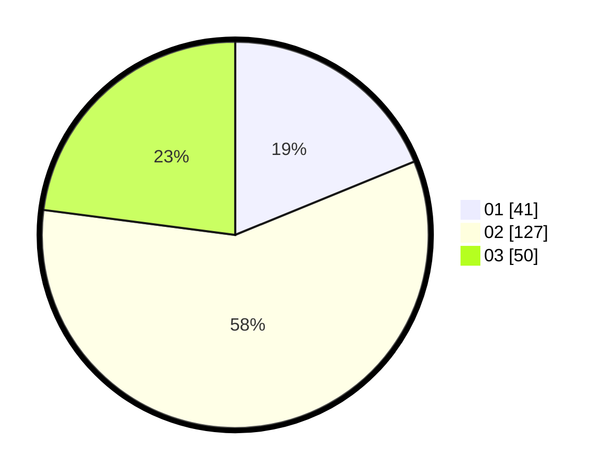

# Hasil

Hasil perolehan suara paslon dapat dilihat pada file paslon-01.txt, paslon-02.txt, dan paslon-03.txt.

Jika tidak ada, artinya data tersebut belum ada pada SIREKAP.

## Perolehan Suara

 * Paslon 01: **41**.
 * Paslon 02: **127**.
 * Paslon 03: **50**.

## Foto C Plano

https://sirekap-obj-formc.kpu.go.id/d1dd/pemilu/ppwp/31/73/01/10/06/3173011006100-20240216-030324--3d8dd1d6-9636-4c53-bbe8-853dfbfe96d8.jpg

https://sirekap-obj-formc.kpu.go.id/d1dd/pemilu/ppwp/31/73/01/10/06/3173011006100-20240216-030327--2cce0330-cd6b-4e02-8be6-dbf9b622a2f9.jpg

https://sirekap-obj-formc.kpu.go.id/d1dd/pemilu/ppwp/31/73/01/10/06/3173011006100-20240216-030326--bd72c53f-0fdb-4a43-8a47-648f20a4ee38.jpg

## DATA PEMILIH TETAP

Jumlah pemilih dalam DPT: **294**.
 * L: **158**.
 * P: **136**.

## DATA PENGGUNA HAK PILIH

Jumlah pengguna hak pilih dalam DPT: **219**.
 * L: **110**.
 * P: **109**.

Jumlah pengguna hak pilih dalam DPTb: **1**.
 * L: **0**.
 * P: **1**.

Jumlah pengguna hak pilih dalam DPK: **1**.
 * L: **0**.
 * P: **1**.

Jumlah pengguna hak pilih: **221**.
 * L: **110**.
 * P: **111**.

## JUMLAH SUARA SAH DAN TIDAK SAH

JUMLAH SELURUH SUARA SAH: **218**.

JUMLAH SUARA TIDAK SAH: **3**.

JUMLAH SELURUH SUARA SAH DAN SUARA TIDAK SAH: **221**.
