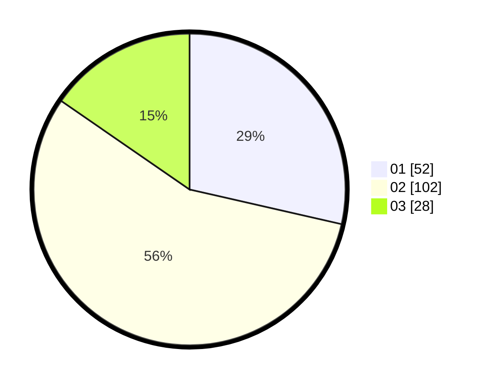

# Hasil

Hasil perolehan suara paslon dapat dilihat pada file paslon-01.txt, paslon-02.txt, dan paslon-03.txt.

Jika tidak ada, artinya data tersebut belum ada pada SIREKAP.

## Perolehan Suara

 * Paslon 01: **52**.
 * Paslon 02: **102**.
 * Paslon 03: **28**.

## Foto C Plano

https://sirekap-obj-formc.kpu.go.id/e5fb/pemilu/ppwp/31/73/01/10/06/3173011006102-20240214-231448--6b319331-f79c-4df9-81bd-f7bf2c5f43f5.jpg

https://sirekap-obj-formc.kpu.go.id/e5fb/pemilu/ppwp/31/73/01/10/06/3173011006102-20240214-231555--a0d50f79-bdcf-470d-a199-d73f69659ae9.jpg

https://sirekap-obj-formc.kpu.go.id/e5fb/pemilu/ppwp/31/73/01/10/06/3173011006102-20240214-231709--327c0be2-39e7-4e40-8d82-0fd5b2b10de6.jpg

## DATA PEMILIH TETAP

Jumlah pemilih dalam DPT: **265**.
 * L: **135**.
 * P: **130**.

## DATA PENGGUNA HAK PILIH

Jumlah pengguna hak pilih dalam DPT: **180**.
 * L: **84**.
 * P: **96**.

Jumlah pengguna hak pilih dalam DPTb: **7**.
 * L: **2**.
 * P: **5**.

Jumlah pengguna hak pilih dalam DPK: **1**.
 * L: **1**.
 * P: **0**.

Jumlah pengguna hak pilih: **188**.
 * L: **87**.
 * P: **101**.

## JUMLAH SUARA SAH DAN TIDAK SAH

JUMLAH SELURUH SUARA SAH: **182**.

JUMLAH SUARA TIDAK SAH: **6**.

JUMLAH SELURUH SUARA SAH DAN SUARA TIDAK SAH: **188**.
