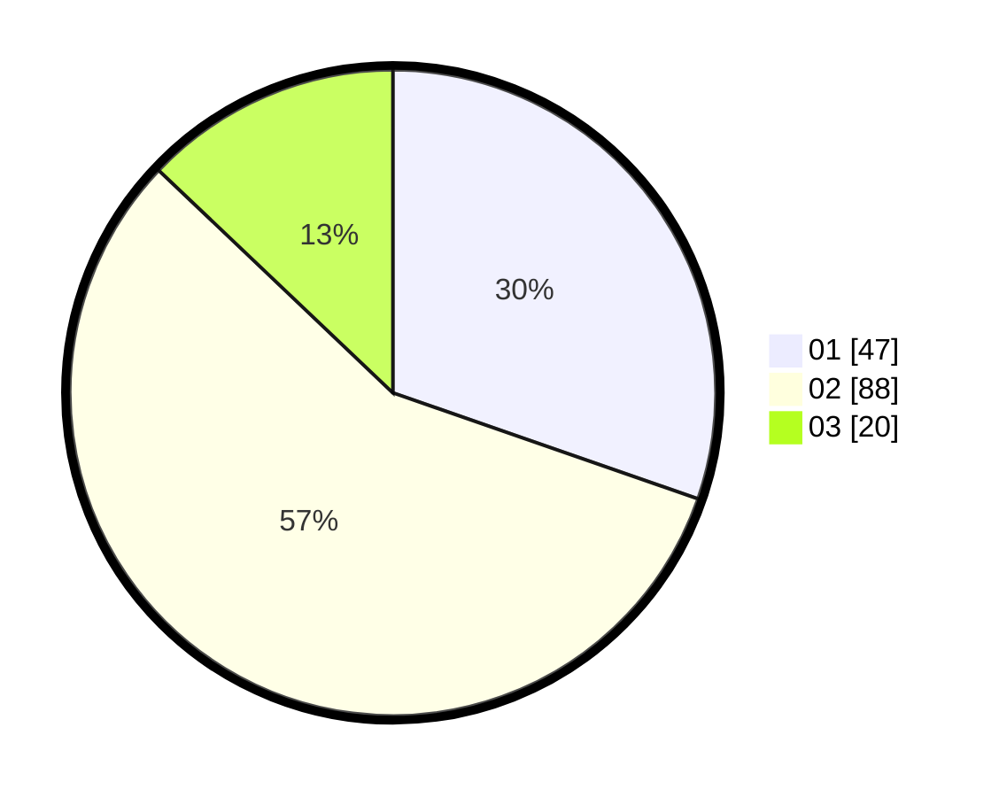

# Hasil

Hasil perolehan suara paslon dapat dilihat pada file paslon-01.txt, paslon-02.txt, dan paslon-03.txt.

Jika tidak ada, artinya data tersebut belum ada pada SIREKAP.

## Perolehan Suara

 * Paslon 01: **47**.
 * Paslon 02: **88**.
 * Paslon 03: **20**.

## Foto C Plano

https://sirekap-obj-formc.kpu.go.id/1c00/pemilu/ppwp/31/73/01/10/06/3173011006104-20240216-024729--1ffc29c1-c005-4209-80e6-2174926f1650.jpg

https://sirekap-obj-formc.kpu.go.id/1c00/pemilu/ppwp/31/73/01/10/06/3173011006104-20240216-024746--fe6c629f-d700-482a-8378-12c27cf6cd5c.jpg

https://sirekap-obj-formc.kpu.go.id/1c00/pemilu/ppwp/31/73/01/10/06/3173011006104-20240216-024737--8bd0e3b8-bab0-4b98-a8bb-5e43415661a5.jpg

## DATA PEMILIH TETAP

Jumlah pemilih dalam DPT: **210**.
 * L: **97**.
 * P: **113**.

## DATA PENGGUNA HAK PILIH

Jumlah pengguna hak pilih dalam DPT: **153**.
 * L: **62**.
 * P: **91**.

Jumlah pengguna hak pilih dalam DPTb: **1**.
 * L: **0**.
 * P: **1**.

Jumlah pengguna hak pilih dalam DPK: **4**.
 * L: **1**.
 * P: **3**.

Jumlah pengguna hak pilih: **158**.
 * L: **63**.
 * P: **95**.

## JUMLAH SUARA SAH DAN TIDAK SAH

JUMLAH SELURUH SUARA SAH: **155**.

JUMLAH SUARA TIDAK SAH: **3**.

JUMLAH SELURUH SUARA SAH DAN SUARA TIDAK SAH: **158**.
