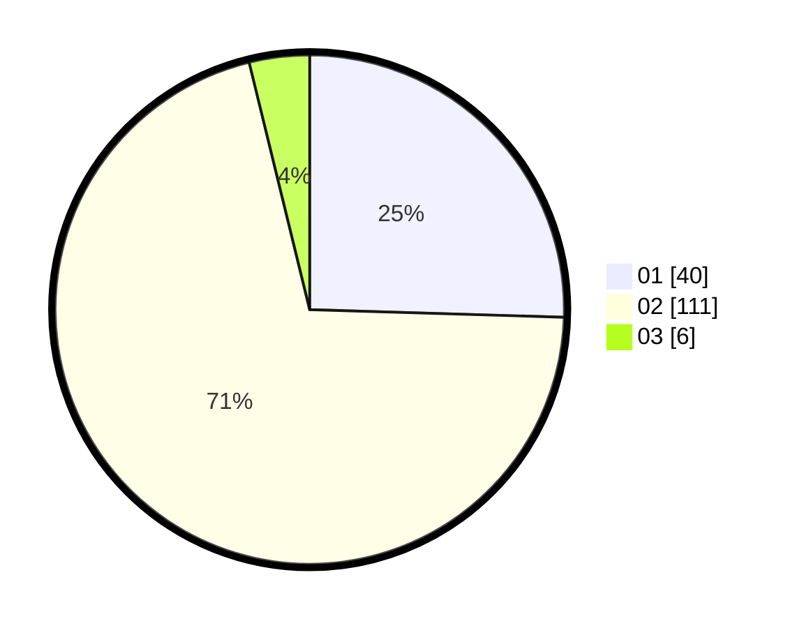

# Hasil

Hasil perolehan suara paslon dapat dilihat pada file paslon-01.txt, paslon-02.txt, dan paslon-03.txt.

Jika tidak ada, artinya data tersebut belum ada pada SIREKAP.

## Perolehan Suara

 * Paslon 01: **40**.
 * Paslon 02: **111**.
 * Paslon 03: **6**.

## Foto C Plano

https://sirekap-obj-formc.kpu.go.id/dc89/pemilu/ppwp/31/73/01/10/06/3173011006114-20240214-235543--0a0e5501-d91a-4f56-9962-cc0bbeb5f69a.jpg

https://sirekap-obj-formc.kpu.go.id/dc89/pemilu/ppwp/31/73/01/10/06/3173011006114-20240214-224207--d4fd22dc-90d2-40c5-a805-148e7984343e.jpg

https://sirekap-obj-formc.kpu.go.id/dc89/pemilu/ppwp/31/73/01/10/06/3173011006114-20240214-224254--95e42b6a-15c4-4316-ad3b-2dacad3e111b.jpg
