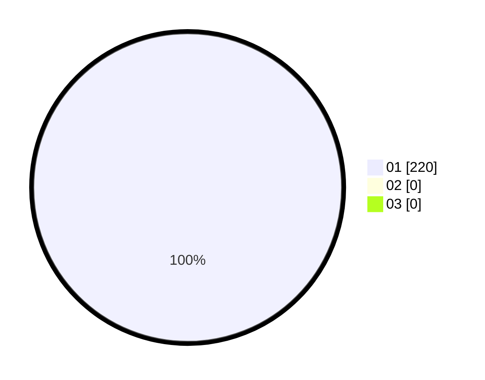

# Hasil

Hasil perolehan suara paslon dapat dilihat pada file paslon-01.txt, paslon-02.txt, dan paslon-03.txt.

Jika tidak ada, artinya data tersebut belum ada pada SIREKAP.

## Perolehan Suara

 * Paslon 01: **220**.
 * Paslon 02: **0**.
 * Paslon 03: **0**.

## Foto C Plano

https://sirekap-obj-formc.kpu.go.id/90a0/pemilu/ppwp/31/73/01/10/06/3173011006120-20240214-213916--5ab4b22e-6169-4d9c-8dee-cc90dec6f67d.jpg

https://sirekap-obj-formc.kpu.go.id/90a0/pemilu/ppwp/31/73/01/10/06/3173011006120-20240214-214051--412f21cb-41ab-4aed-9e37-be34bfcd6f3c.jpg

https://sirekap-obj-formc.kpu.go.id/90a0/pemilu/ppwp/31/73/01/10/06/3173011006120-20240214-214310--e4725e29-bfc6-4ca5-acca-b55f51d2eca1.jpg
