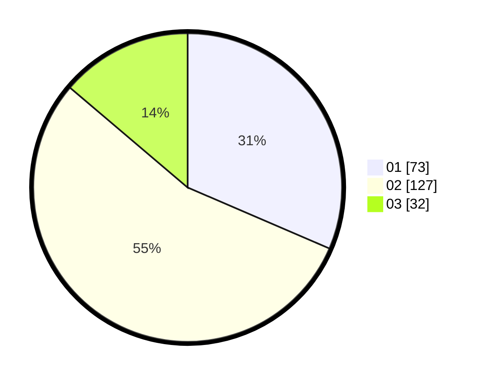

# Hasil

Hasil perolehan suara paslon dapat dilihat pada file paslon-01.txt, paslon-02.txt, dan paslon-03.txt.

Jika tidak ada, artinya data tersebut belum ada pada SIREKAP.

## Perolehan Suara

 * Paslon 01: **73**.
 * Paslon 02: **127**.
 * Paslon 03: **32**.

## Foto C Plano

https://sirekap-obj-formc.kpu.go.id/a44f/pemilu/ppwp/31/73/01/10/06/3173011006131-20240215-110938--e412b835-ebeb-4a4f-90eb-0ebe45670e1a.jpg

https://sirekap-obj-formc.kpu.go.id/a44f/pemilu/ppwp/31/73/01/10/06/3173011006131-20240215-111000--fb152e28-9d3f-4956-ab27-27e83cc0e303.jpg

https://sirekap-obj-formc.kpu.go.id/a44f/pemilu/ppwp/31/73/01/10/06/3173011006131-20240215-110949--502d84f7-e85c-4d24-80ae-f6c72fded229.jpg

## DATA PEMILIH TETAP

Jumlah pemilih dalam DPT: **295**.
 * L: **155**.
 * P: **140**.

## DATA PENGGUNA HAK PILIH

Jumlah pengguna hak pilih dalam DPT: **231**.
 * L: **120**.
 * P: **111**.

Jumlah pengguna hak pilih dalam DPTb: **3**.
 * L: **0**.
 * P: **3**.

Jumlah pengguna hak pilih dalam DPK: **4**.
 * L: **2**.
 * P: **2**.

Jumlah pengguna hak pilih: **238**.
 * L: **122**.
 * P: **116**.

## JUMLAH SUARA SAH DAN TIDAK SAH

JUMLAH SELURUH SUARA SAH: **232**.

JUMLAH SUARA TIDAK SAH: **5**.

JUMLAH SELURUH SUARA SAH DAN SUARA TIDAK SAH: **237**.
