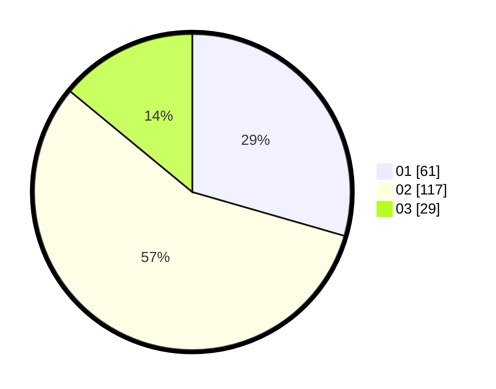

# Hasil

Hasil perolehan suara paslon dapat dilihat pada file paslon-01.txt, paslon-02.txt, dan paslon-03.txt.

Jika tidak ada, artinya data tersebut belum ada pada SIREKAP.

## Perolehan Suara

 * Paslon 01: **61**.
 * Paslon 02: **117**.
 * Paslon 03: **29**.

## Foto C Plano

https://sirekap-obj-formc.kpu.go.id/7efe/pemilu/ppwp/31/73/01/10/06/3173011006134-20240214-222532--0070c50b-b6ee-4a36-8db7-ca2c55c8493c.jpg

https://sirekap-obj-formc.kpu.go.id/7efe/pemilu/ppwp/31/73/01/10/06/3173011006134-20240214-222740--960130ed-3f9f-4ee8-87a6-ea9e4b13ac5d.jpg

https://sirekap-obj-formc.kpu.go.id/7efe/pemilu/ppwp/31/73/01/10/06/3173011006134-20240215-042341--4838166d-f7a6-47bc-8754-b1aea99ef53d.jpg

## DATA PEMILIH TETAP

Jumlah pemilih dalam DPT: **295**.
 * L: **149**.
 * P: **146**.

## DATA PENGGUNA HAK PILIH

Jumlah pengguna hak pilih dalam DPT: **295**.
 * L: **149**.
 * P: **146**.

Jumlah pengguna hak pilih dalam DPTb: **4**.
 * L: **2**.
 * P: **2**.

Jumlah pengguna hak pilih dalam DPK: **0**.
 * L: **0**.
 * P: **0**.

Jumlah pengguna hak pilih: **299**.
 * L: **151**.
 * P: **148**.

## JUMLAH SUARA SAH DAN TIDAK SAH

JUMLAH SELURUH SUARA SAH: **207**.

JUMLAH SUARA TIDAK SAH: **1**.

JUMLAH SELURUH SUARA SAH DAN SUARA TIDAK SAH: **208**.
