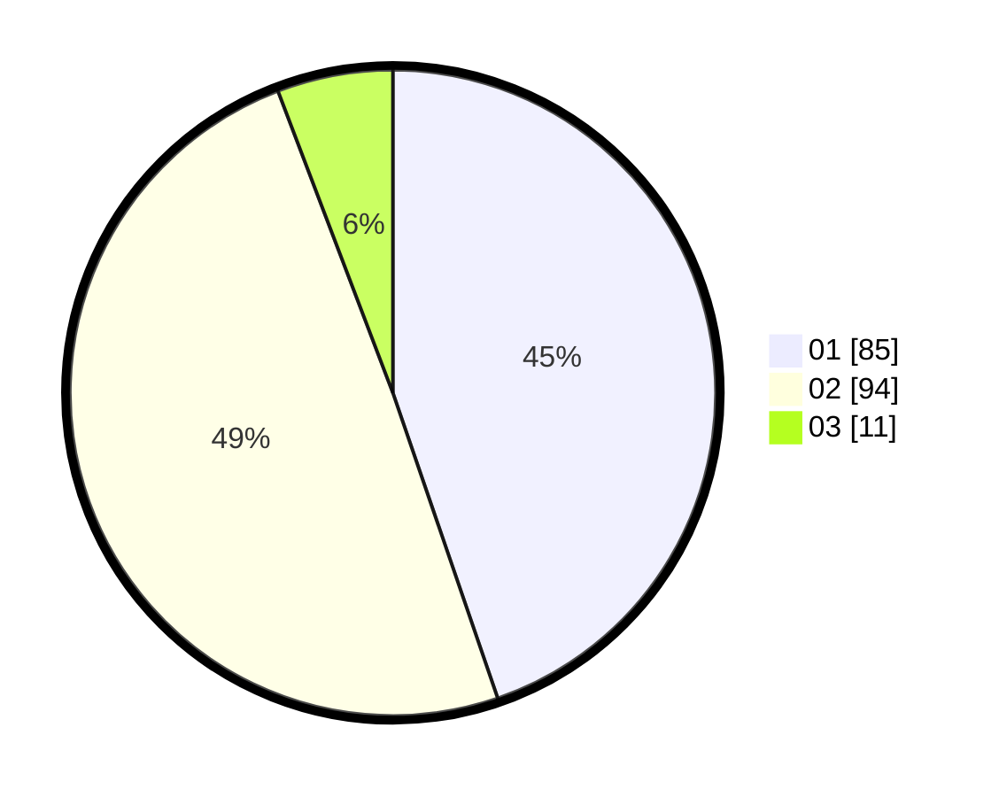

# Hasil

Hasil perolehan suara paslon dapat dilihat pada file paslon-01.txt, paslon-02.txt, dan paslon-03.txt.

Jika tidak ada, artinya data tersebut belum ada pada SIREKAP.

## Perolehan Suara

 * Paslon 01: **85**.
 * Paslon 02: **94**.
 * Paslon 03: **11**.

## Foto C Plano

https://sirekap-obj-formc.kpu.go.id/6f3c/pemilu/ppwp/31/73/01/10/06/3173011006135-20240214-195559--4f2f90e0-1ffc-4954-807c-ceb8ae152fc6.jpg

https://sirekap-obj-formc.kpu.go.id/6f3c/pemilu/ppwp/31/73/01/10/06/3173011006135-20240215-204930--39babcc5-8eab-48fa-8882-c3f470597694.jpg

https://sirekap-obj-formc.kpu.go.id/6f3c/pemilu/ppwp/31/73/01/10/06/3173011006135-20240215-204930--dc92176f-d6d3-4c62-ae18-ccad01c77761.jpg

## DATA PEMILIH TETAP

Jumlah pemilih dalam DPT: **190**.
 * L: **83**.
 * P: **107**.

## DATA PENGGUNA HAK PILIH

Jumlah pengguna hak pilih dalam DPT: **186**.
 * L: **83**.
 * P: **103**.

Jumlah pengguna hak pilih dalam DPTb: **4**.
 * L: **0**.
 * P: **4**.

Jumlah pengguna hak pilih dalam DPK: **0**.
 * L: **0**.
 * P: **0**.

Jumlah pengguna hak pilih: **190**.
 * L: **83**.
 * P: **107**.

## JUMLAH SUARA SAH DAN TIDAK SAH

JUMLAH SELURUH SUARA SAH: **190**.

JUMLAH SUARA TIDAK SAH: **0**.

JUMLAH SELURUH SUARA SAH DAN SUARA TIDAK SAH: **190**.
