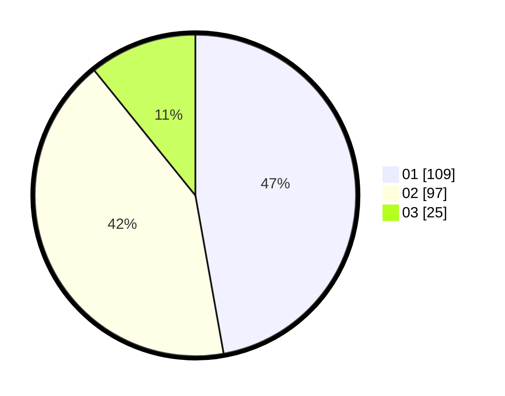

# Hasil

Hasil perolehan suara paslon dapat dilihat pada file paslon-01.txt, paslon-02.txt, dan paslon-03.txt.

Jika tidak ada, artinya data tersebut belum ada pada SIREKAP.

## Perolehan Suara

 * Paslon 01: **109**.
 * Paslon 02: **97**.
 * Paslon 03: **25**.

## Foto C Plano

https://sirekap-obj-formc.kpu.go.id/6a33/pemilu/ppwp/31/73/01/10/06/3173011006138-20240215-215143--07baa2dc-0f10-4e7e-b1ea-ba2275cb8855.jpg

https://sirekap-obj-formc.kpu.go.id/6a33/pemilu/ppwp/31/73/01/10/06/3173011006138-20240215-215147--f6ecdaaa-eb35-484e-93ed-150f76fa2df6.jpg

https://sirekap-obj-formc.kpu.go.id/6a33/pemilu/ppwp/31/73/01/10/06/3173011006138-20240215-215145--8ea10a06-6d0d-44f6-9c34-3c31c6300e4b.jpg

## DATA PEMILIH TETAP

Jumlah pemilih dalam DPT: **291**.
 * L: **141**.
 * P: **150**.

## DATA PENGGUNA HAK PILIH

Jumlah pengguna hak pilih dalam DPT: **233**.
 * L: **104**.
 * P: **129**.

Jumlah pengguna hak pilih dalam DPTb: **0**.
 * L: **0**.
 * P: **0**.

Jumlah pengguna hak pilih dalam DPK: **3**.
 * L: **2**.
 * P: **1**.

Jumlah pengguna hak pilih: **236**.
 * L: **106**.
 * P: **130**.

## JUMLAH SUARA SAH DAN TIDAK SAH

JUMLAH SELURUH SUARA SAH: **231**.

JUMLAH SUARA TIDAK SAH: **5**.

JUMLAH SELURUH SUARA SAH DAN SUARA TIDAK SAH: **236**.
