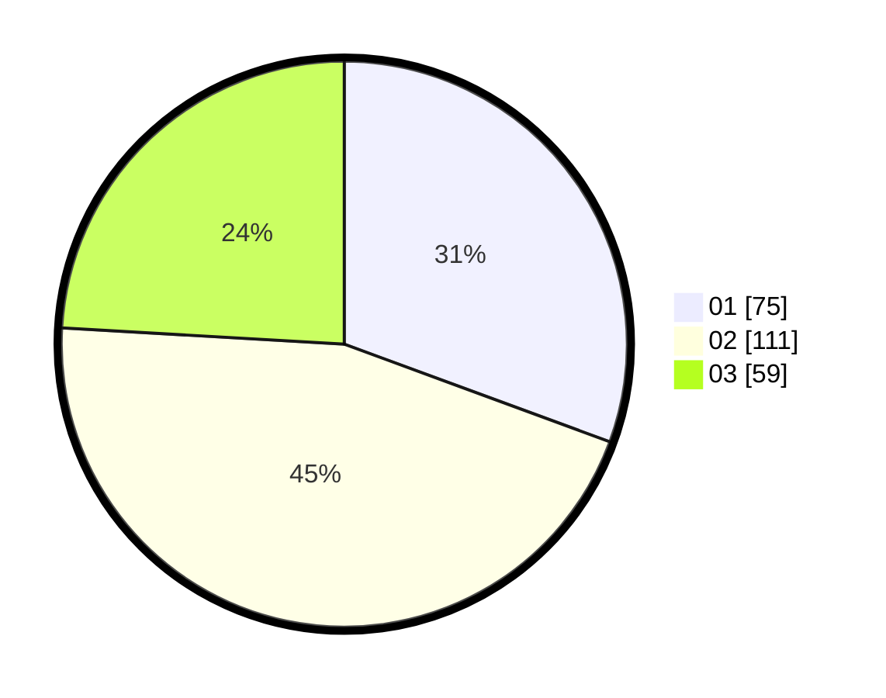

# Hasil

Hasil perolehan suara paslon dapat dilihat pada file paslon-01.txt, paslon-02.txt, dan paslon-03.txt.

Jika tidak ada, artinya data tersebut belum ada pada SIREKAP.

## Perolehan Suara

 * Paslon 01: **75**.
 * Paslon 02: **111**.
 * Paslon 03: **59**.

## Foto C Plano

https://sirekap-obj-formc.kpu.go.id/5c7a/pemilu/ppwp/31/73/01/10/06/3173011006141-20240215-231309--50b228ec-b2a3-422f-a2d9-80823b7b6940.jpg

https://sirekap-obj-formc.kpu.go.id/5c7a/pemilu/ppwp/31/73/01/10/06/3173011006141-20240215-231236--8b28ec13-9303-42f4-a204-82f9b16af7b2.jpg

https://sirekap-obj-formc.kpu.go.id/5c7a/pemilu/ppwp/31/73/01/10/06/3173011006141-20240215-232534--99d79938-9cb0-492a-a17a-a57d09fc9678.jpg

## DATA PEMILIH TETAP

Jumlah pemilih dalam DPT: **289**.
 * L: **151**.
 * P: **138**.

## DATA PENGGUNA HAK PILIH

Jumlah pengguna hak pilih dalam DPT: **250**.
 * L: **127**.
 * P: **123**.

Jumlah pengguna hak pilih dalam DPTb: **1**.
 * L: **0**.
 * P: **1**.

Jumlah pengguna hak pilih dalam DPK: **3**.
 * L: **2**.
 * P: **1**.

Jumlah pengguna hak pilih: **254**.
 * L: **129**.
 * P: **125**.

## JUMLAH SUARA SAH DAN TIDAK SAH

JUMLAH SELURUH SUARA SAH: **245**.

JUMLAH SUARA TIDAK SAH: **9**.

JUMLAH SELURUH SUARA SAH DAN SUARA TIDAK SAH: **254**.
